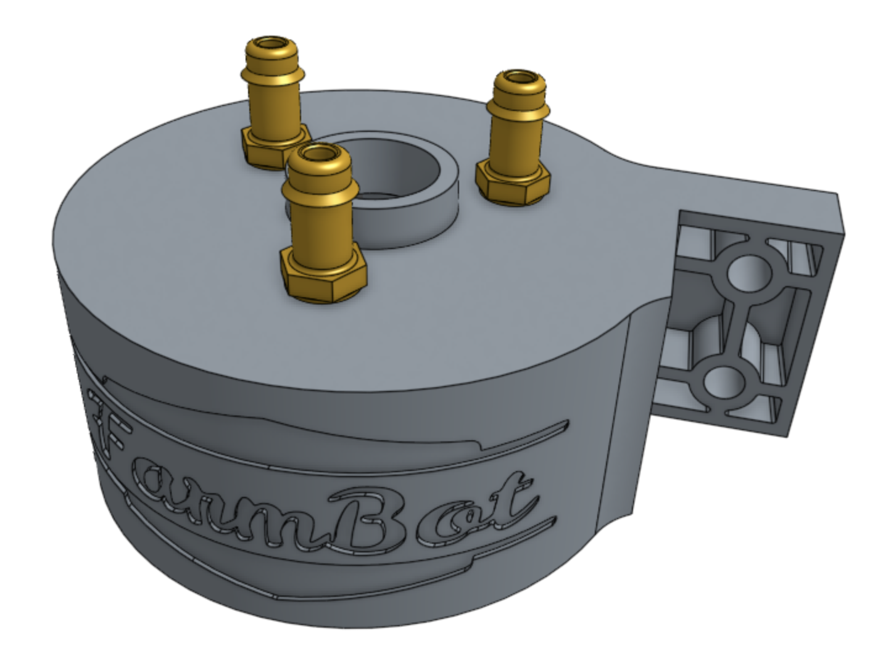
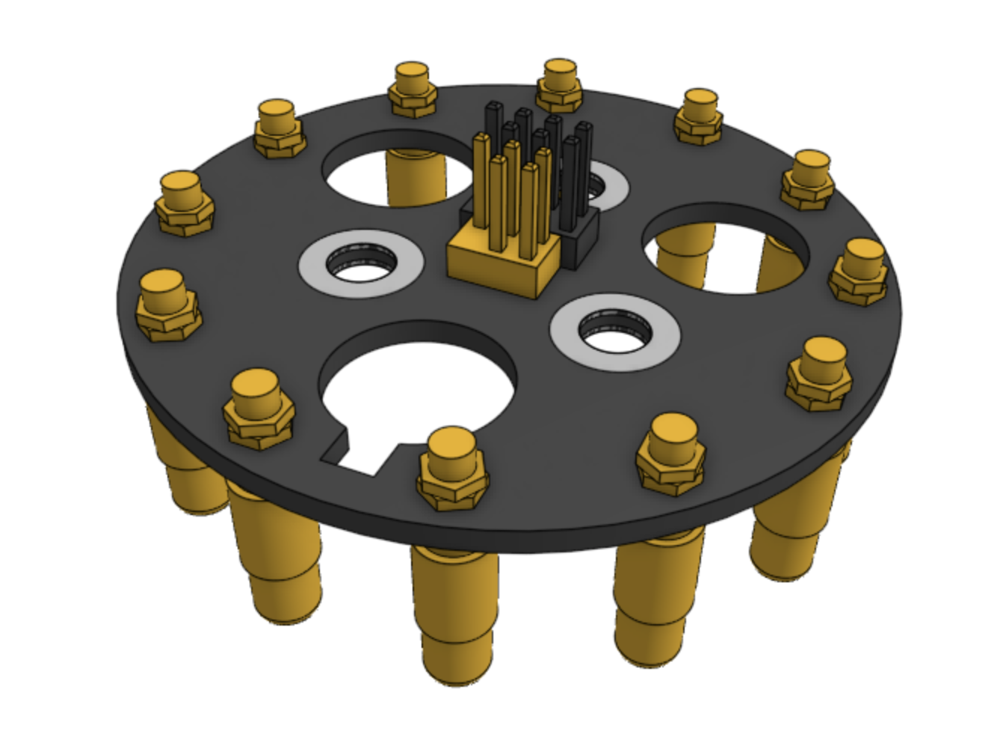
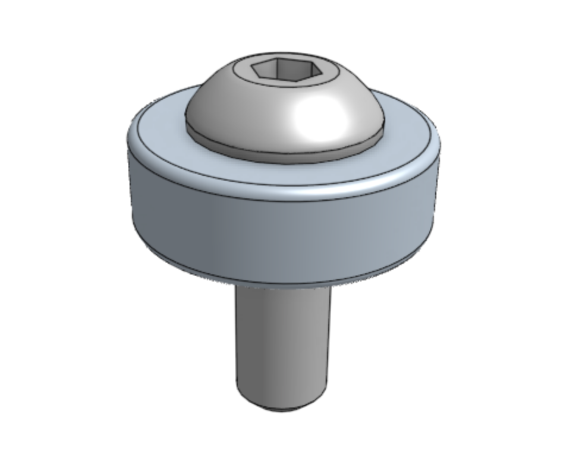
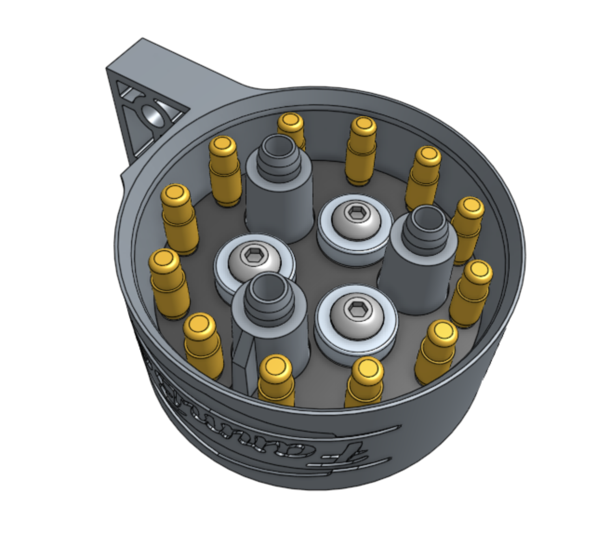
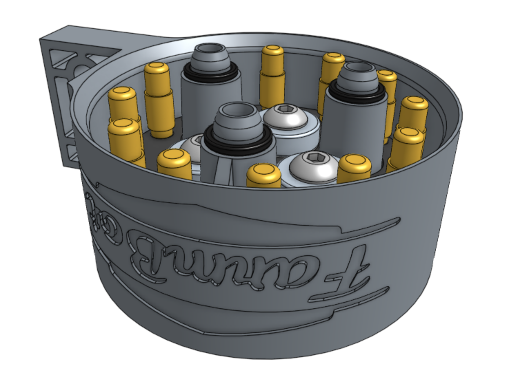

# Component list

|Component                     |Qty  |
|------------------------------|-----|
|UTM                           |1
|UTM PCB                       |1
|Pogo Pin                      |12
|Pogo Pin Jam Nut              |24
|Ring Magnet                   |3
|M5 x 16mm Screw               |3
|Barb                          |3
|X-Profile O-Ring              |3
|UTM Box                       |1

# Step 1: Attach pogo pins to the PCB

Attach 12 **pogo pins** to the **UTM PCB** using 24 **jam nuts** (2 per pogo pin).

# Step 2: Mount the PCB and magnets

Insert the **UTM PCB** into the [[UTM]]. It is keyed, and should only fit in one orientation.

Slide a **ring magnet** onto an [[M5 x 16mm screw]]. The magnet's `South` face should be butted against the screw head.

Fasten the PCB in the UTM with the ring magnet and screw. Repeat with two more magnets and screws.



# Step 3: Add o-rings

Slide three **x-profile o-rings** onto the [[UTM]].

# Step 4: Add barbs

Screw three **barbs** into the top of the [[UTM]].

# Step 5: Pack

Pack the **pre-assembled UTM** into the **UTM box**.

# Box specifications

|                                |                              |
|--------------------------------|------------------------------|
|**Box style**                   |Top flap (standard FarmBot box design)
|**Inner dimensions (L x W x H)**|75mm x 95mm x 52mm
|**Outer dimensions (L x W x H)**|80mm x 100mm x 57mm
|**Material**                    |Cardboard
|**Color**                       |Brown
|**Printing**                    |**[UTM.pdf](_images/utm_box_graphic.pdf)** <i class="fa fa-file-pdf-o">
|**Fill**                        |None
