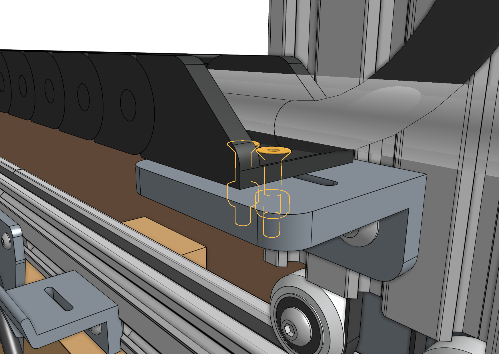
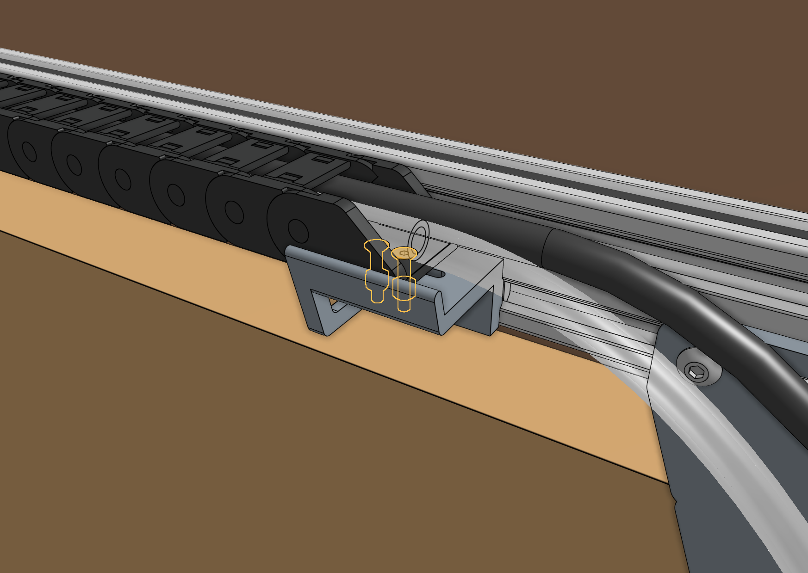

# Step 1: Mount the cable carrier

There is only one orientation that the **x-axis cable carrier** mounts to the **gantry** and **tracks**, and it is determined by the orientation of the **end pieces**. Lay the cable carrier onto the track's **horizontal cable carrier supports** to ensure you have it correctly oriented.

Attach the **x-axis cable carrier** to the **30mm horizontal cable carrier mount** using two [[M3 x 16mm flat head screws]] and [[M3 locknuts]].

Attach the other end of the **x-axis cable carrier** to the [[30mm horizontal cable carrier support]] nearest the middle of the **tracks** using two [[M3 x 16mm flat head screws]] and [[M3 locknuts]].

# What's next?

 * [X-Axis Motors](x-axis-motors.md)
