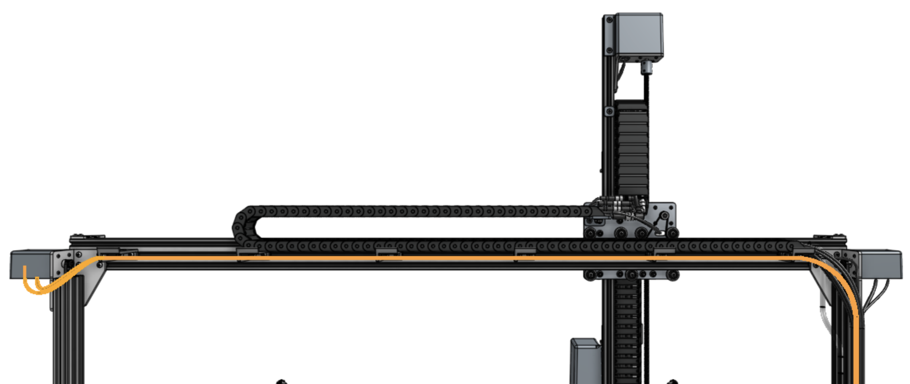

# Step 1: Connect the X2 motor and encoder cables

Connect the **X2 motor and encoder cables** (highlighted orange in the image below) to the **X2 motor and encoder** on the left side of FarmBot (when looking at the device from the back) by feeding the cables through the slots in all of the **horizontal cable carrier supports** along the [[gantry main beam]].

# Step 2: Install the LED light strip

Feed the [[LED strip]] (highlighted orange in the image below) through the horizontal cable carrier supports on the gantry. You can secure the end of the strip to the final cable carrier support using a zip tie.

In a few steps from now, you will [plug the LED light strip into the Farmduino](../electronics.md#step-2-connect-the-peripherals).

# What's next?

 * [Universal Tool Mount](../tools/utm.md)
