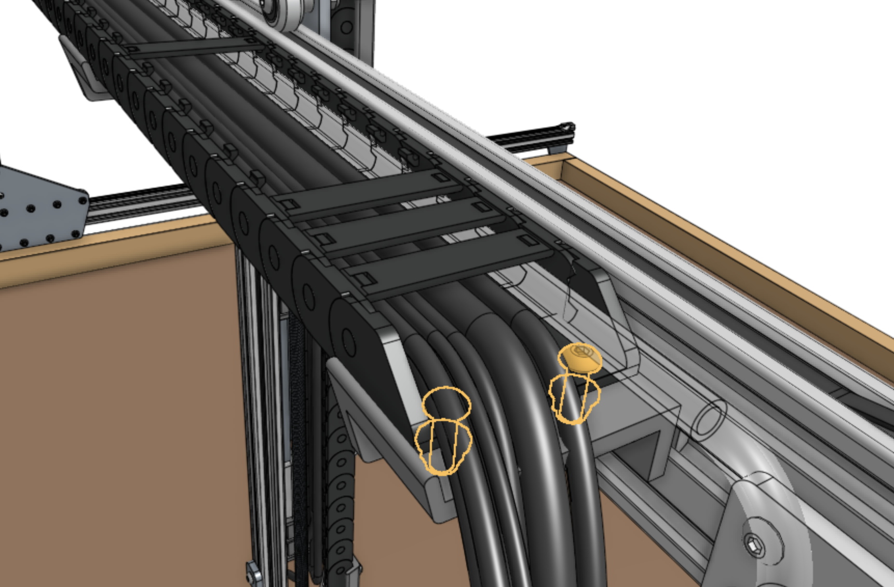
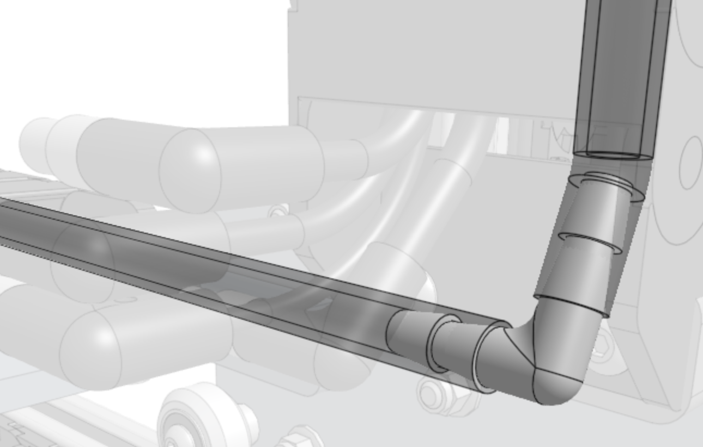

# Step 1: Attach the cable carrier

There is only one orientation that the **y-axis cable carrier** mounts to the **cross-slide** and **gantry**, and it is determined by the orientation of the **end pieces**. Lay the cable carrier onto the gantry's **horizontal cable carrier supports** according to the images below.



Attach the **y-axis cable carrier** to the [[80mm cable carrier mount]] using two [[M5 x 16mm screws]] and [[M5 flange locknuts]]. The screws should thread firmly through the cable carrier end piece.

Attach the **y-axis cable carrier** to the [[60mm horizontal cable carrier support]] nearest the left gantry column using two [[M5 x 16mm screws]] and [[M5 flange locknuts]]. The screws should thread firmly through the cable carrier end piece.

# Step 2: Connect the tubing

Push the [[90 degree barb]] onto the **z-axis water tube**. Then push the **y-axis water tube** onto the other end of the barb.



# Step 3: Connect the cabling

Connect the z-axis and y-axis sections of the following cables together:

  * **Vacuum pump cable (Z)** to **vacuum pump cable (Y)** with the 4-pin connector
  * **ZZ encoder cable** to **ZY encoder cable** with the 7-pin connector
  * **ZZ motor cable** to **ZY motor cable** with the 4-pin connector
  * **UTM cable (Z)** to **UTM cable (Y)** with the 12-pin connector
  * [[Camera]] to [[camera cable]] with the 4-pin connector

{%
include callout.html
type="danger"
title="CAUTION: The camera, vacuum pump, and z-axis motor cables use the same 4-pin connectors"
content="When connecting the ends coming from the y-axis cable carrier to the ends coming from the z-axis cable carrier, ensure you are connecting camera to camera, vacuum pump to vacuum pump, and z-axis motor to z-axis motor.

You can check to see which cable is which by tugging on a cable on one end of the cable carrier and seeing which cable moves on the other end.

**We strongly recommend you take your time with this step because a mistake could cause damage to the electronics.**"
%}





Pay special attention that you fully insert the 90-degree connectors together. This may require a multi-step process of pushing together, slightly tightening the thumb screws, pushing together again, and tightening some more. See the video below for detail.



# Step 4: Connect the y-axis motor and encoder

Connect the **y-axis motor and encoder cables** to the **y-axis motor** and **encoder**.





# Step 5: Remove slack

Reduce the amount of extra tubing and wiring between the **y-axis cable carrier** and the **z-axis cable carrier** by gently pulling any extra cable or tubing length through the **y-axis cable carrier**. It can be difficult to coax the contents around the bend of the cable carrier, so take your time and ensure that you are not pulling anything too hard.



# What's next?

 * [X-Axis Cable Carrier](x-axis-cable-carrier.md)
