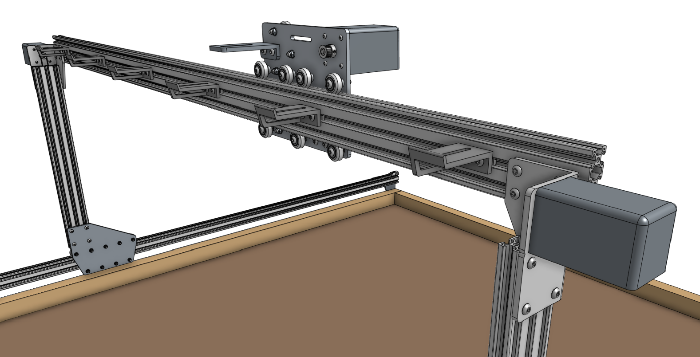
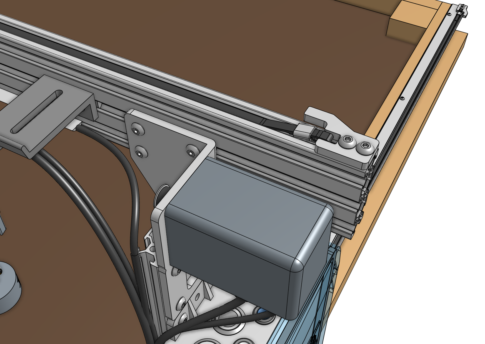
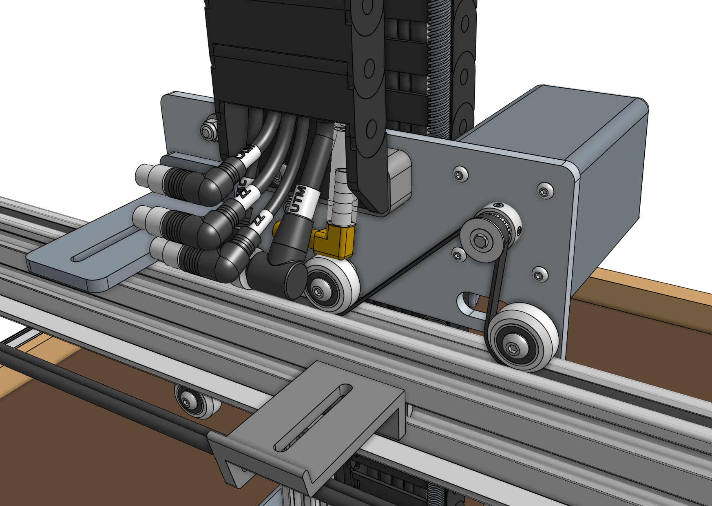
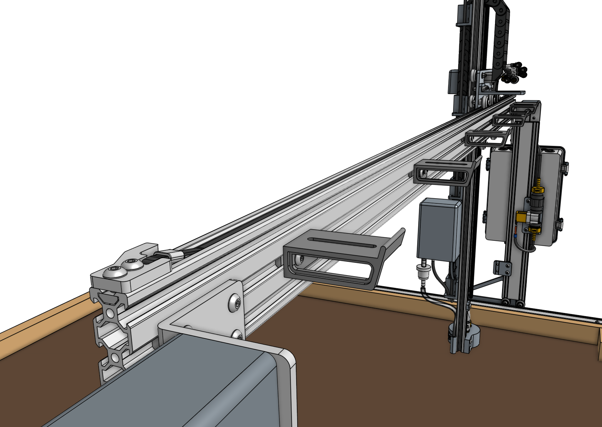



# Step 1: Slide the cross-slide onto the gantry main beam

In order for the cross-slide to slide smoothly and wobble-free on the gantry main beam, you must first adjust the [[eccentric spacers]] of the bottom three V-wheels. Adjust the [[eccentric spacers]] using the [eccentric spacer adjustment reference guide](../extras/reference/eccentric-spacer-adjustment.md).

Once you have adjusted the eccentric spacers, slide the cross-slide onto the gantry main beam.

The cross-slide should move easily across the full width of the gantry. If you feel any significant resistance, re-adjust the eccentric spacers so that there is less resistance to movement. On Genesis (XL) models, pay special attention at the connection point between the two gantry main beams. If there is any significant bump or resistance to movement at the joint, you may use sand paper to sand away the bump.

# Step 2: Feed and secure the belt

Attach a [[belt clip]] to the end of the gantry main beam using two [[M5 x 10mm screws]] and a [[20mm nut bar]]. Then secure one end of the **y-axis GT2 timing belt** (2m long for Genesis, 3.5m long for XL) to the belt clip using the [belt installation](../extras/reference/belt-installation.md) reference guide.

Feed the **belt** under the end [[V-wheel]] of the cross-slide, then over the [[pulley]] and under the remaining three [[V-wheels]]. The flat side of the belt should be in contact with your V-wheels while the toothed side should engage with the teeth on the pulley.



Secure the belt at the other end of the gantry with another [[belt clip]], [[20mm nut bar]], and two [[M5 x 10mm screws]]. Ensure there is a small amount of tension on the belt once everything is in place.

# What's next?

 * [Cables and Tubing](cables-and-tubing.md)
