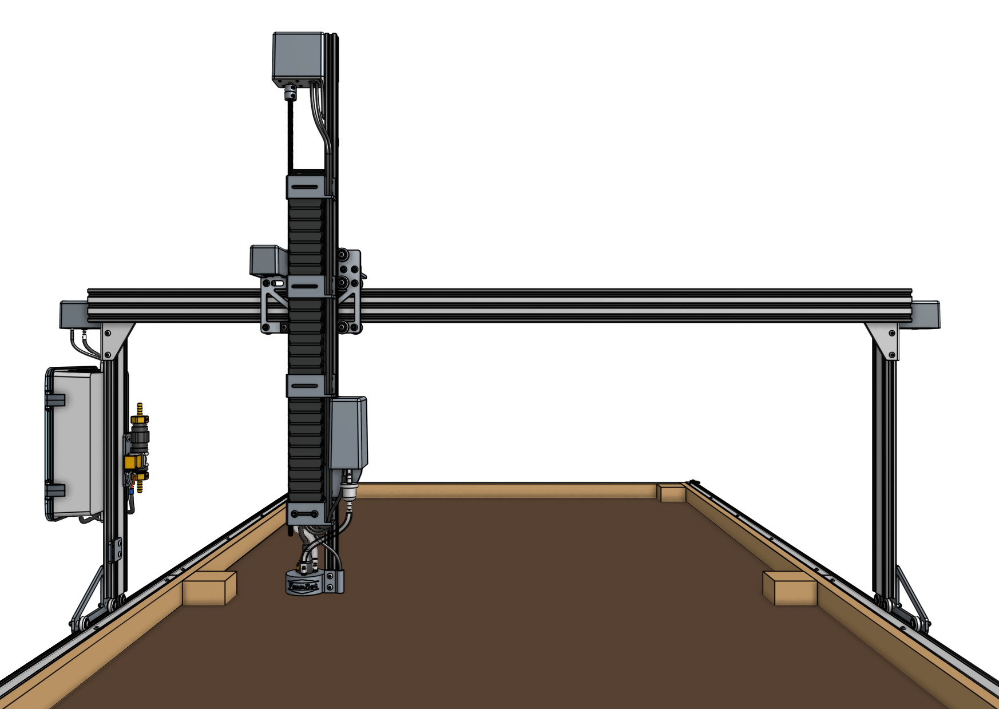
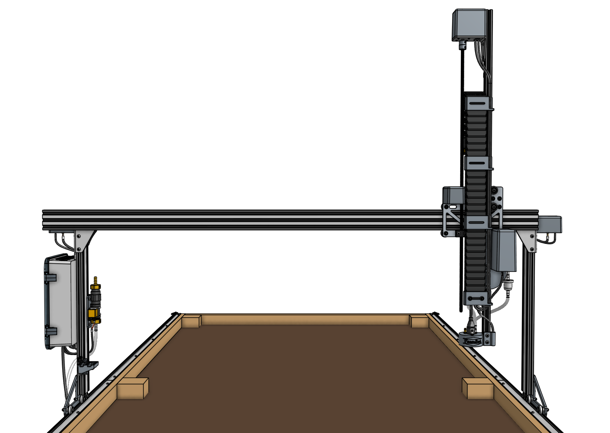
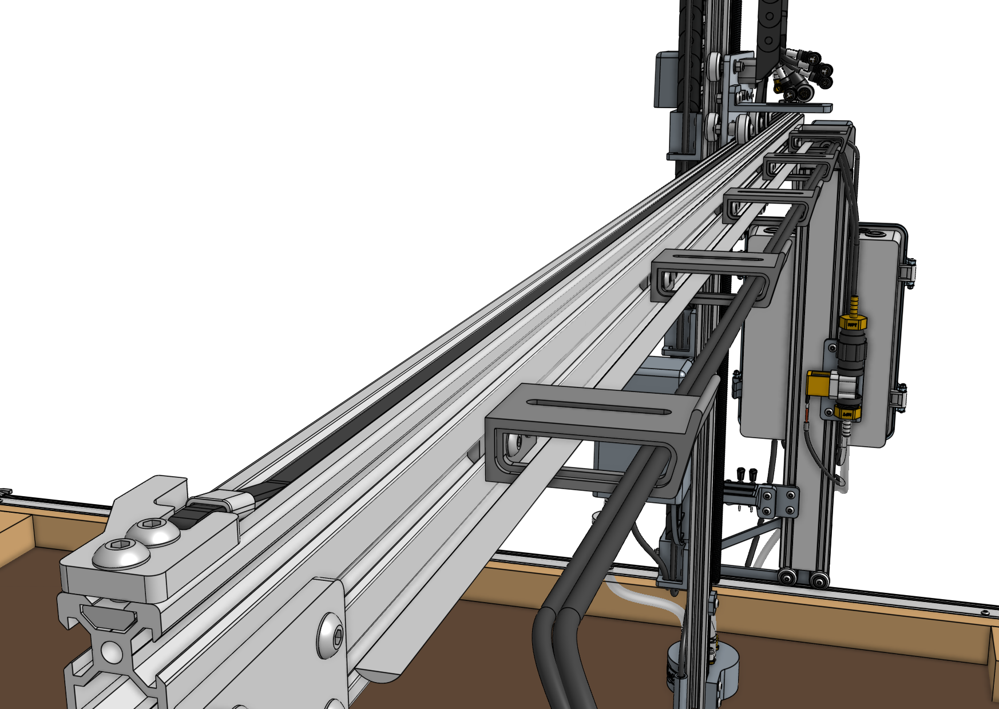
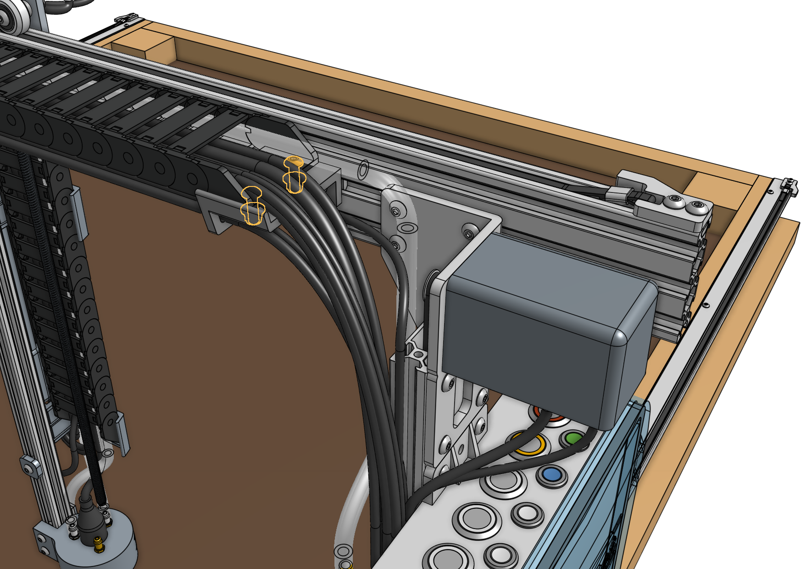
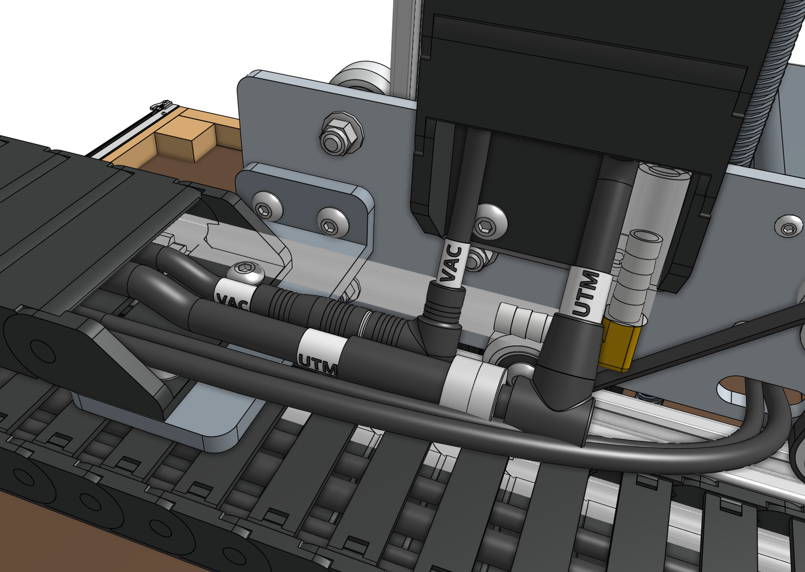
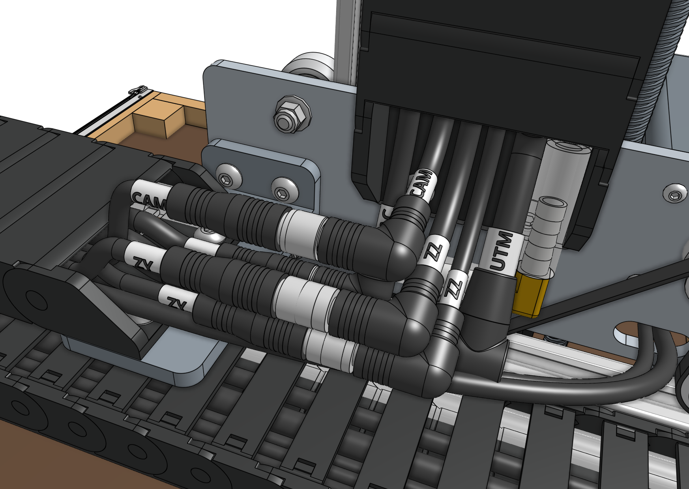
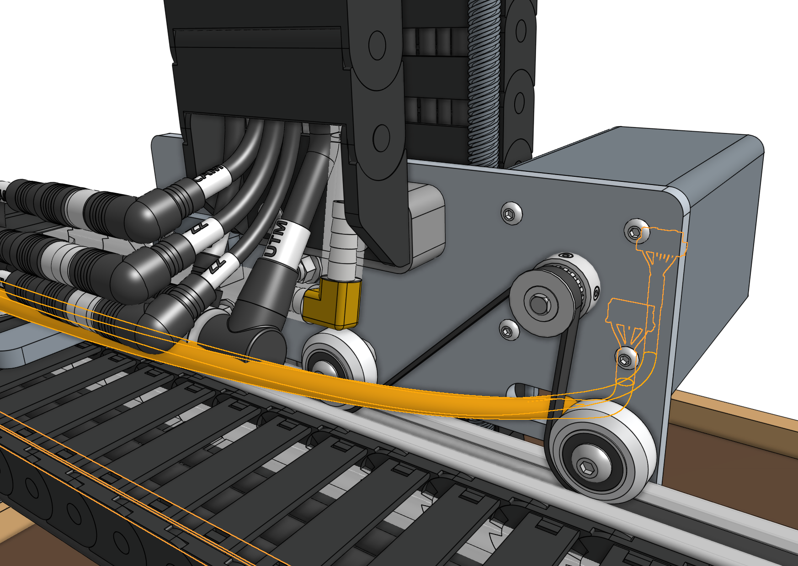



# Step 1: Add the cable carrier mount

Attach the [[80mm cable carrier mount]] to the [[cross-slide plate]] using two [[M5 x 16mm screws]] and [[M5 flange locknuts]]. The bracket should be on the opposite side of the plate as the motor.

# Step 2: Slide the cross-slide onto the gantry main beam

In order for the cross-slide to slide smoothly and wobble-free on the gantry main beam, you must first adjust the [[eccentric spacers]] of the bottom two V-wheels. Adjust the [[eccentric spacers]] using the [eccentric spacer adjustment reference guide](../extras/reference/eccentric-spacer-adjustment.md).

Once you have adjusted the eccentric spacers, slide the cross-slide onto the gantry main beam.



# Step 3: Feed and secure the belt

Secure one end of the *short* [[belt]] to a [[belt clip]] using a [[belt sleeve]] and then attach the clip to the end of the gantry main beam using two [[M5 x 10mm screws]] and a [[20mm nut bar]]. The tab of the belt clip should be oriented towards the front of the FarmBot. Refer to the [belt installation guide](../extras/reference/belt-installation.md) for reference.

Feed the belt under the first [[V-wheel]] of the cross-slide, then over the [[pulley]] and under the remaining two [[V-wheels]]. The flat side of the belt should be in contact with the V-wheels while the toothed side should engage with the teeth on the pulley.



Secure the belt at the other end of the gantry with another [[belt clip]], [[20mm nut bar]], and two [[M5 x 10mm screws]]. Ensure there is a small amount of tension on the belt once everything is in place.

# Step 4: Attach the cable carrier

Lay the **y-axis cable carrier** onto the [[60mm horizontal cable carrier supports]] on the [[gantry main beam]] such that the end with the **90-degree** connectors will connect to the **cross-slide**. Attach the cable carrier to the [[80mm cable carrier mount]] using two [[M5 x 16mm screws]] and [[M5 flange locknuts]]. The screws should thread firmly through the cable carrier end piece.

Attach the **y-axis cable carrier** to the [[60mm horizontal cable carrier support]] nearest the electronics box using two [[M5 x 16mm screws]] and [[M5 flange locknuts]]. The screws should thread firmly through the cable carrier end piece.

# Step 5: Connect the tubing

Push the **y-axis water tube** onto the [[90-degree barb]] and the [[NPT to barb adapter]] on top of the [[solenoid valve]].



# Step 6: Connect the cabling

Connect the z-axis and y-axis sections of the following cables together:

  * **Vacuum pump cable (Z)** to **vacuum pump cable (Y)** with the 4-pin connector
  * **ZZ encoder cable** to **ZY encoder cable** with the 7-pin connector
  * **ZZ motor cable** to **ZY motor cable** with the 4-pin connector
  * **UTM cable (Z)** to **UTM cable (Y)** with the 12-pin connector
  * [[Camera]] to [[camera cable]] with the 4-pin connector

{%
include callout.html
type="danger"
title="CAUTION: The camera, vacuum pump, and z-axis motor cables use the same 4-pin connectors"
content="When connecting the ends coming from the y-axis cable carrier to the ends coming from the z-axis cable carrier, ensure you are connecting camera to camera, vacuum pump to vacuum pump, and z-axis motor to z-axis motor.

You can check to see which cable is which by tugging on a cable on one end of the cable carrier and seeing which cable moves on the other end.

**We strongly recommend you take your time with this step because a mistake could cause damage to the electronics.**"
%}





Pay special attention that you fully insert the 90-degree connectors together. This may require a multi-step process of pushing together, slightly tightening the thumb screws, pushing together again, and tightening some more. See the video below for detail.



# Step 7: Connect the y-axis motor and encoder

Connect the `Y` [[motor cable]] and `Y` [[encoder cable]] to the y-axis [[motor]] and [[encoder]].





# Step 8: Remove slack

Reduce the amount of extra tubing and wiring between the **y-axis cable carrier** and the **z-axis cable carrier** by gently pulling any extra cable or tubing length through the **y-axis cable carrier**. It can be difficult to coax the contents around the bend of the cable carrier, so take your time and ensure that you are not pulling anything too hard.



# What's next?

 * [Tools](tools.md)
