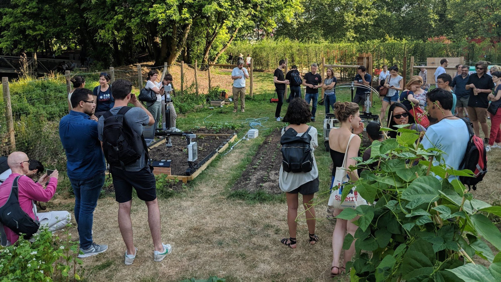
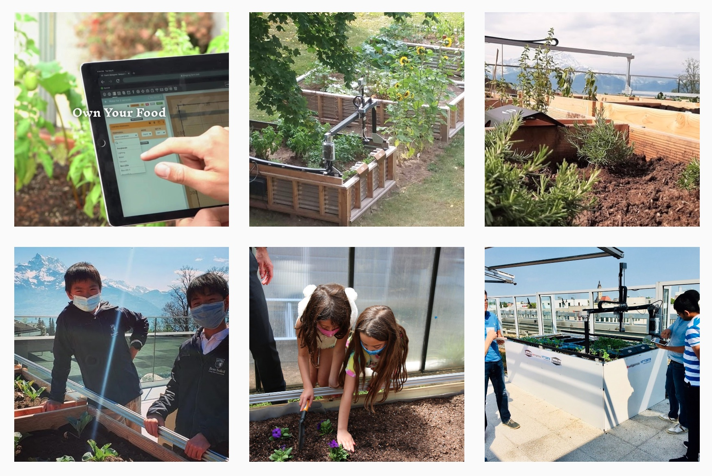
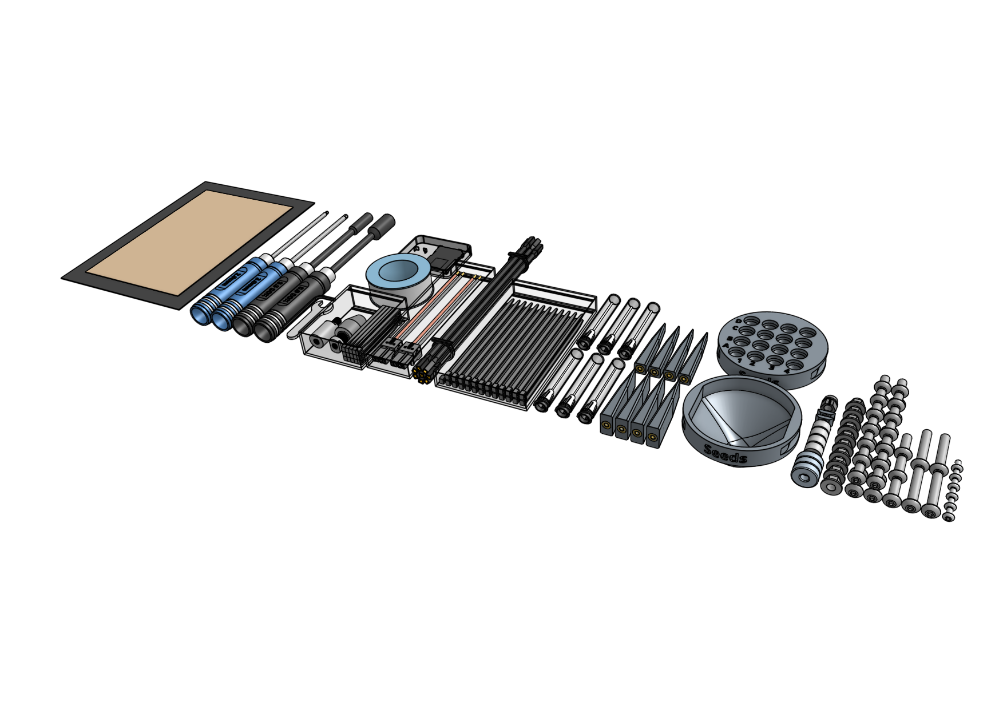

# Software setup

You're now ready to move onto the software portion of setting up your FarmBot. Refer to the [getting started guide](https://software.farm.bot/docs/getting-started) on our software documentation hub for instructions on how to:

- Create a web app account
- Configure FarmBot to connect to your WiFi network and web app account
- Complete the setup wizard
- Use the FarmBot web app

# Picking seeds

Now that you've got your bot assembled and connected to the web, it's time to start growing things! Most common garden veggies will work great with FarmBot, though there are some limitations and best practices. Check out our [seed selection guide](http://seeds.farm.bot) for tips and best practices.



# Join the community forum

You're now part of a global community of FarmBot owners who are growing food at home, [using FarmBot as a teaching tool](https://www.youtube.com/watch?v=8PV0aR9Jl9A), and pushing forward the cutting edge of agriculture!

We encourage you to connect with the community by joining the FarmBot forum at [forum.farmbot.org](https://forum.farmbot.org/). Signing up is completely free and will allow you to chat with others about best practices, modification ideas, troubleshooting issues, gardening tips and tricks, and to be inspired by what everyone is growing.

# Stay in touch

If you aren't already, consider subscribing to our [email newsletter](http://newsletter.farm.bot/). We'll keep you informed about software updates, hardware upgrades, and new FarmBot drops. Plus, an occasional new video highlighting how one of our customers are using FarmBot in a unique way.

We also have accounts on [Instagram](http://instagram.farm.bot/), [YouTube](http://youtube.farm.bot/), [Facebook](http://facebook.farm.bot/), [Twitter](http://twitter.farm.bot/), and [LinkedIn](http://linkedin.farm.bot/) if you'd like to follow us on any of those platforms.

# Storing extra parts

Your FarmBot kit included a few extra pieces of some small parts such as screws and nuts just in case we miscounted by a few or you lost anything in the grass during assembly.

We recommend keeping everything that is left over in a box along with the getting started guide, camera calibration card, the microSD card adapter, and all of the assembly tools.

_For illustrative purposes only. Not all kits will have these exact parts left over after assembly._

# Trimming belts

About a week after using your FarmBot, you may consider using scissors to trim off excess belt. This can make for a tidier installation, especially if you didn't build your FarmBot to the maximum possible size.

Just keep in mind that once cut, there is no gluing the belt back together - you would need to [order new belts](https://farm.bot/search?q=Belt) if you made a mistake. Only trim if you are certain you won't need the extra length!

# What's next?

- [Maintenance](../extras/maintenance.md)
- [Troubleshooting](../extras/troubleshooting.md)
- [Mods and Add-Ons](../extras/mods.md)
