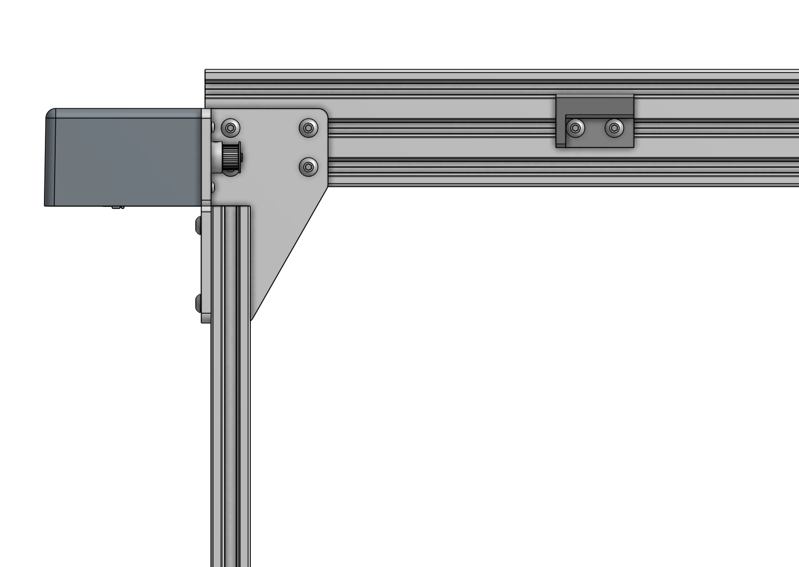
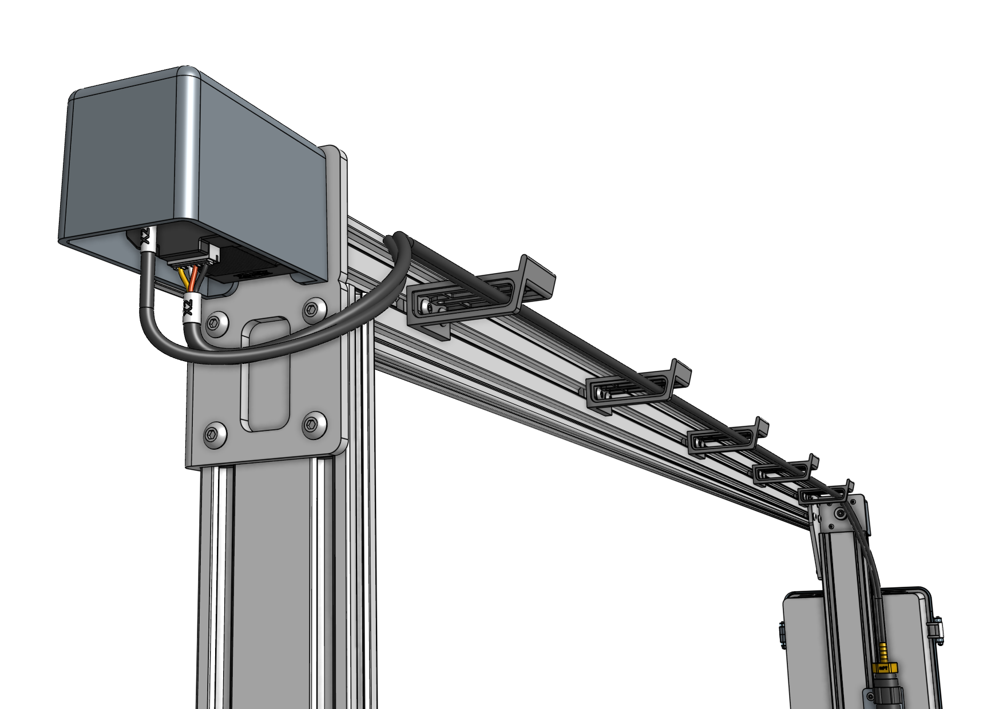
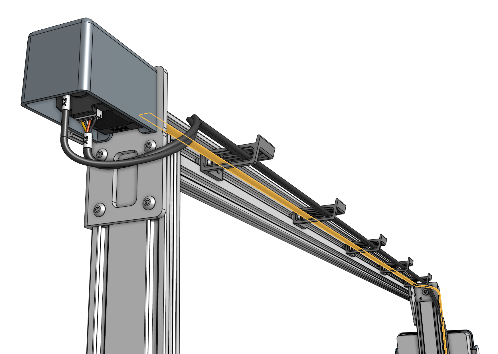
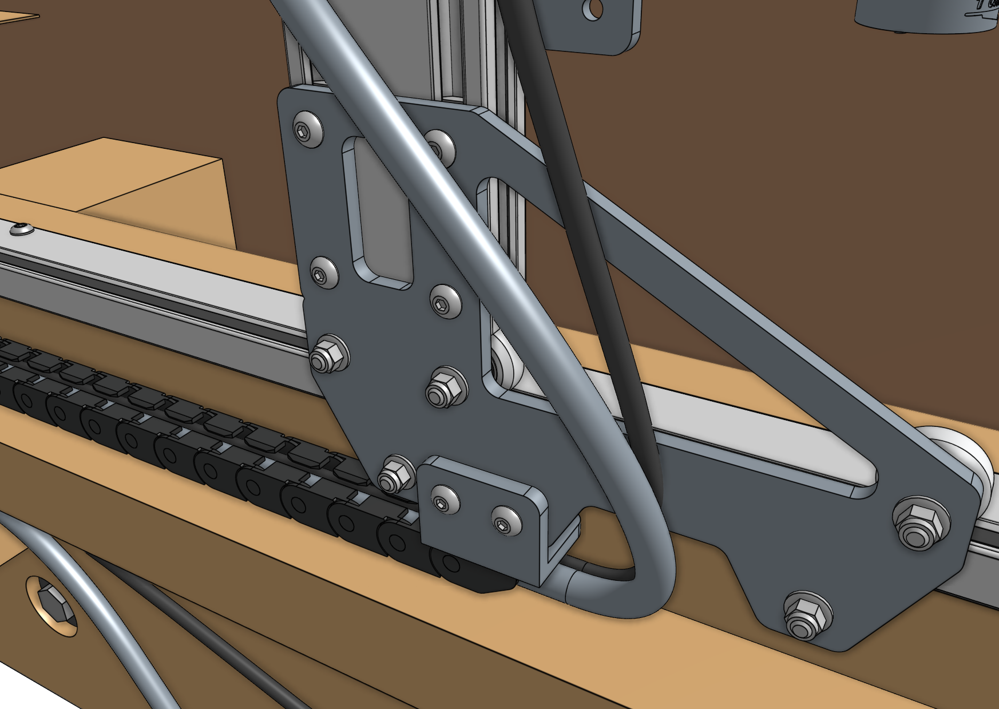
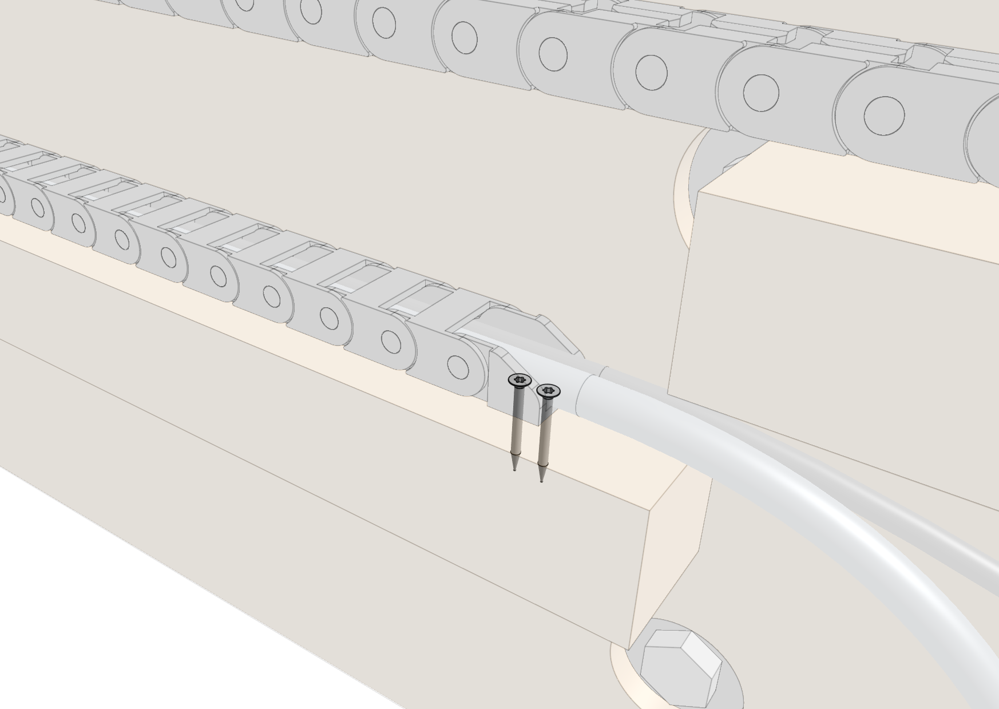
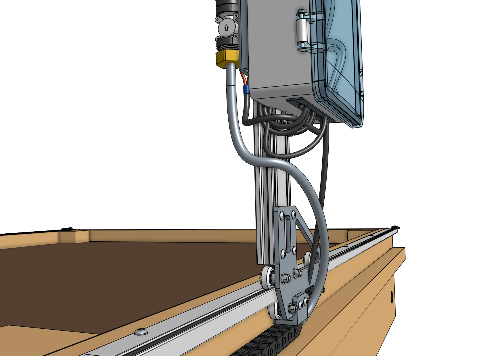
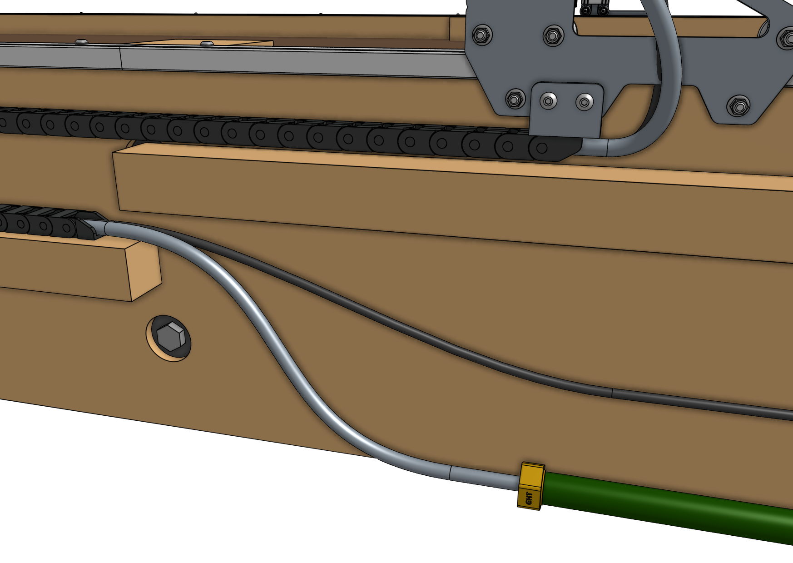
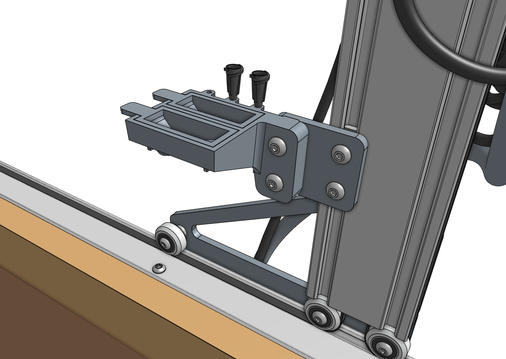



# Step 1: Slide the columns onto the tracks

The [[eccentric spacers]] on the lower two [[V-wheels]] of each [[gantry wheel plate]] are used for making fine adjustments to the spacing between the lower wheels and the upper wheels. Adjusting this spacing is the key to having your gantry move smoothly and wobble-free across the tracks.

If the spacing is too little, then the gantry will not fit onto the tracks at all or be tough to move. If the spacing is too great, then the gantry will be wobbly and loose.



Once the spacers have been adjusted, slide the [[gantry columns]] onto the **tracks**. The direction that the wheel plates extend from the column is towards the front of FarmBot. Meanwhile, the gantry column with the electronics box should be on the left side of the supporting infrastructure that includes the wood cable carrier supports.

# Step 2: Assemble the main beam



Place both [[gantry main beams]] on a flat surface such as a table or patio. Using two [[140mm nut bars]] and eight [[M5 x 10mm screws]], attach the [[gantry joining bracket]] to the *lower two slots* of both extrusions. The notch in the middle of the bracket should be aligned with the joint between the two extrusions.

# Step 3: Attach the cable carrier supports

Using [[M5 x 10mm screws]] and [[40mm nut bars]], attach five [[60mm horizontal cable carrier supports]] to the *middle slot* of the [[gantry main beam]] extrusion. For Genesis kits, there is only one main beam extrusion, so only five supports will be used.

For Genesis (XL) kits, there are two main beam extrusions, so 10 supports will be used, and they should be positioned on the same side of the extrusions as the [[gantry joining bracket]].

# Step 4: Attach the main beam



Lift up the [[gantry main beam]] and position it onto the front of the **gantry corner brackets**. The cable carrier supports should be on the same side of the main beam as the gantry corner brackets. Slide a [[60mm nut bar]] into each end of the *lowest two extrusion slots* and use [[M5 x 10mm screws]] to loosely attach the main beam to the corner brackets.

The gantry main beam should be positioned as follows:

* The top face of the main beam should be 20mm *above* the top edges of the gantry corner brackets.
* The end of the main beam on the electronics box side should extend beyond the [[horizontal motor housing]] by at least 10mm or 0.5". If you built your supporting infrastructure to the maximum width, then the main beam should not be extended any further than this.
* The other end of the main beam (opposite the electronics box) can extend beyond the [[right gantry corner bracket]] by any amount. If you have built your supporting infrastructure to the maximum width, then the main beam will not extend at all beyond the corner bracket.



Ensure that the gantry columns are **vertical** and form a **90 degree angle** with the main beam. Then tighten the [[M5 x 10mm screws]].



# Step 5: Connect the X2 motor and encoder cables

Connect the `X2` [[motor cable]] and `X2` [[encoder cable]] to the X2 [[motor]] and [[encoder]] (located on the side opposite the electronics box). Then route the cables through the slots in all of the [[60mm horizontal cable carrier supports]] along the [[gantry main beam]].



# Step 6: Install the LED light strip

Route the [[LED strip]] (highlighted orange in the image below) through the [[60mm horizontal cable carrier supports]] on the [[gantry main beam]]. The end with the connector should be positioned near the electronics box. You can secure the strip to the first and last cable carrier supports using [[100mm zip ties]].



# Step 7: Feed the belts

Drop the ends of one of the *longer* [[belts]] down the large opening in a [[gantry column]], ensuring that the belt teeth engage the [[pulley]].

Grab the ends of the belt at the bottom of the gantry column and feed them under the [[V-wheels]] of the [[gantry wheel plate]], then along the top of the [[track extrusions]] to the ends of the tracks. The flat side of the belt should be in contact with the V-wheels.



# Step 8: Secure the belts

Secure one end of the belt to the tracks by using a [[belt clip]], [[belt sleeve]], [[20mm nut bar]], and two [[M5 x 10mm screws]]. The belt must be wrapped through the clip as outlined in the [belt installation guide](../extras/reference/belt-installation.md), with the tab of the belt clip extending over the outside of the bed. Repeat for the other end of the belt on the other end of the tracks.





Repeat steps 7 and 8 for the second x-axis belt on the other side of the FarmBot.

# Step 9: Attach the cable carrier

Lay the [[x-axis cable carrier]] onto the supporting infrastructure's wood **cable carrier support**. Connect the end of the cable carrier _without an end piece_ to the **end piece** that is pre-mounted on the bottom of the left gantry column.



Fasten the other end of the cable carrier to the wood cable carrier support using two [[T10 flathead wood screws]].

# Step 10: Connect the tubing

Push the [[water tube]] coming from the [[x-axis cable carrier]] onto the lower [[NPT to barb adapter]] beneath the [[solenoid valve]].

Screw the [[garden hose to barb adapter]] onto the **garden hose**. Then push the [[water tube]] coming from the bottom of the [[x-axis cable carrier]] onto the barb.



# Step 10: Attach the seed trough holder

Attach the [[seed trough holder]] to the [[seed trough holder mount]] using two [[M5 x 30mm screws]] and [[M5 flange locknuts]]. Then place the two [[seed troughs]] into the holder. Optionally, you may store up to three luer lock needles in the holder as well.

# What's next?

 * [Cross-Slide and Z-Axis](cross-slide-and-z-axis.md)
