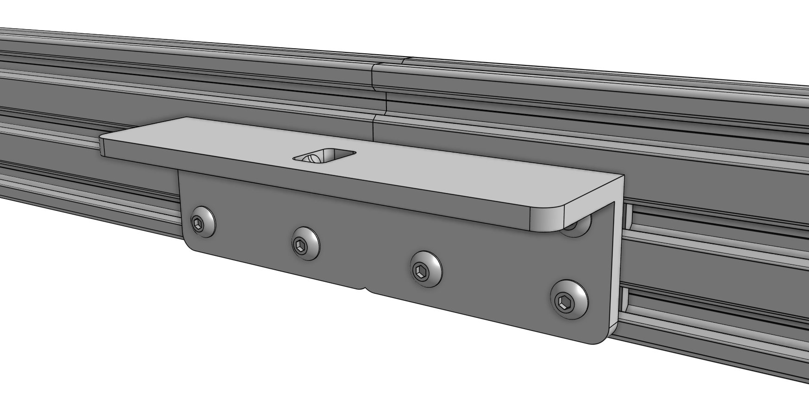
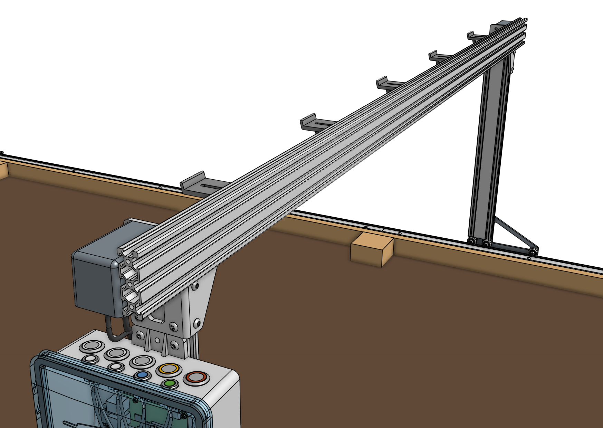



# Step 1: Adjust the V-wheel spacing

The [[eccentric spacers]] on the lower wheels of each gantry wheel plate assembly are used for making fine adjustments to the spacing between the lower wheels and the upper wheels. Adjusting this spacing is the key to having your gantry move smoothly and wobble-free across the tracks.

If the spacing is too little, then the gantry will not fit onto the tracks at all or be tough to move. If the spacing is too great, then the gantry will be wobbly and loose. Adjust the [[eccentric spacers]] using the [eccentric spacer adjustment reference guide](../extras/reference/eccentric-spacer-adjustment.md).

# Step 2: Slide onto the tracks



Slide the [[gantry columns]] onto the **tracks**. The direction that the wheel plates extend from the column is towards the front of FarmBot. Ensure that the cable carrier supports (mounted to the tracks) are on the left side of the FarmBot.

# Step 3: Assemble the main beam



Place both [[gantry main beams]] on a flat surface such as a table or patio. Using two [[140mm nut bars]] and eight [[M5 x 10mm screws]], attach the [[gantry joining bracket]] to the *lower two slots* of both extrusions. The notch in the middle of the bracket should be aligned with the joint between the two extrusions.

# Step 4: Attach the cable carrier supports

Using [[M5 x 10mm screws]] and [[40mm nut bars]], attach five [[60mm horizontal cable carrier supports]] to the *middle slot* of the [[gantry main beam]] extrusion. For Genesis kits, there is only one main beam extrusion, so only five supports will be used.

For Genesis (XL) kits, there are two main beam extrusions, so 10 supports will be used, and they should be positioned on the same side of the extrusions as the [[gantry joining bracket]].

# Step 5: Attach the main beam



Lift up the [[gantry main beam]] and position it onto the front of the **gantry corner brackets**. The cable carrier supports should be on the same side of the main beam as the gantry corner brackets. Slide a [[60mm nut bar]] into each end of the *lowest two extrusion slots* and use [[M5 x 10mm screws]] to loosely attach the main beam to the corner brackets.





Ensure that the gantry columns are **vertical** and form a **90 degree angle** with the main beam. Then tighten the [[M5 x 10mm screws]]. Depending on the spacing of your tracks, the gantry main beam may extend beyond the corner brackets. This is ok.

# Step 6: Feed the belts

Drop the ends of one of the *longer* [[belts]] down the large opening in a [[gantry column]], ensuring that the belt teeth engage the [[pulley]].

Grab the ends of the belt at the bottom of the gantry column and feed them under the [[V-wheels]] of the [[gantry wheel plate]], then along the top of the [[track extrusions]] to the ends of the tracks. The flat side of the belt should be in contact with the V-wheels.



# Step 7: Secure the belts

Secure one end of the belt to the tracks by using a [[belt clip]], [[belt sleeve]], [[20mm nut bar]], and two [[M5 x 10mm screws]]. The belt must be wrapped through the clip as outlined in the [belt installation guide](../extras/reference/belt-installation.md), with the tab of the belt clip extending over the outside of the bed. Repeat for the other end of the belt on the other end of the tracks.





Repeat steps 6 and 7 for the second x-axis belt on the other side of the FarmBot.

# Step 8: Equalize the gantry



To equalize the gantry, first ensure that the x-axis motors are unpowered. For first time installation this will always be the case. Then gently push or pull on the gantry **from the middle of the gantry main beam** such that it moves slowly along the tracks about 30cm. This process will remove any torque on the gantry, and ensure it is not crooked.

If you were equalizing the gantry as part of routine maintenance, remember to FIND HOME X after equalization. Otherwise, proceed with the assembly process.

# What's next?

 * [Cross-Slide and Z-Axis](cross-slide-and-z-axis.md)
