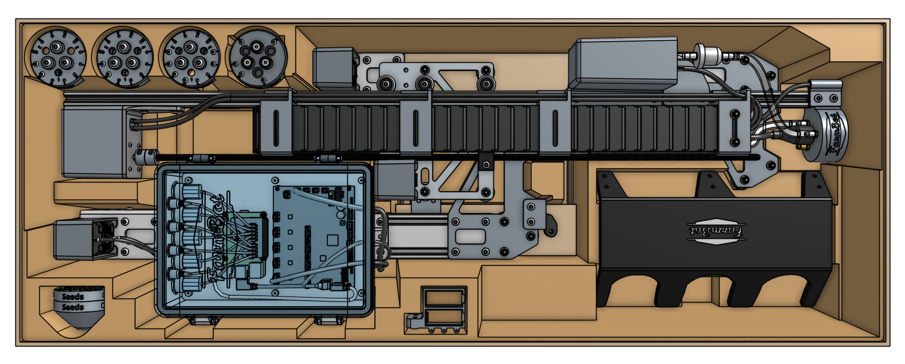
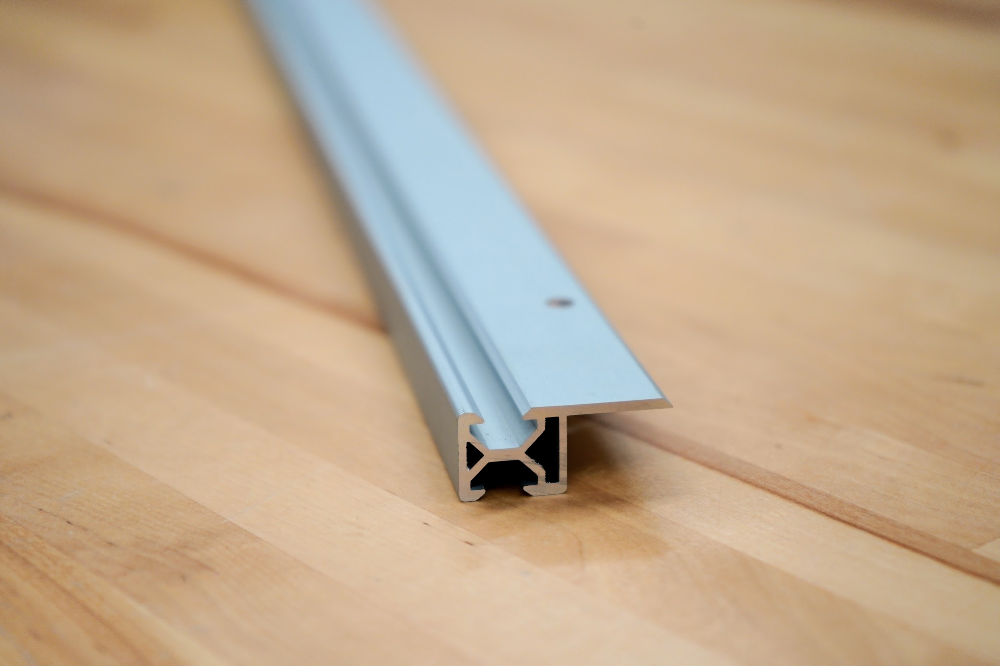
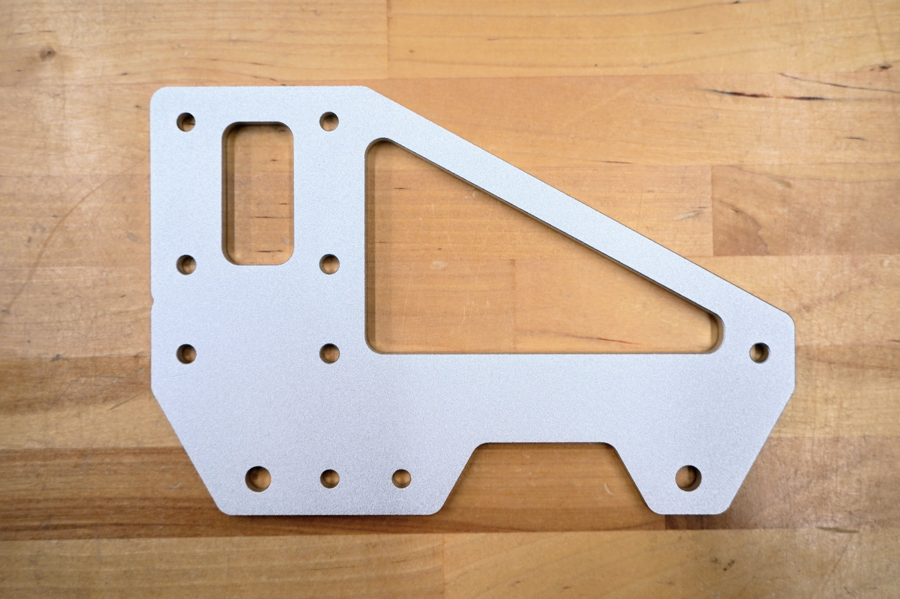
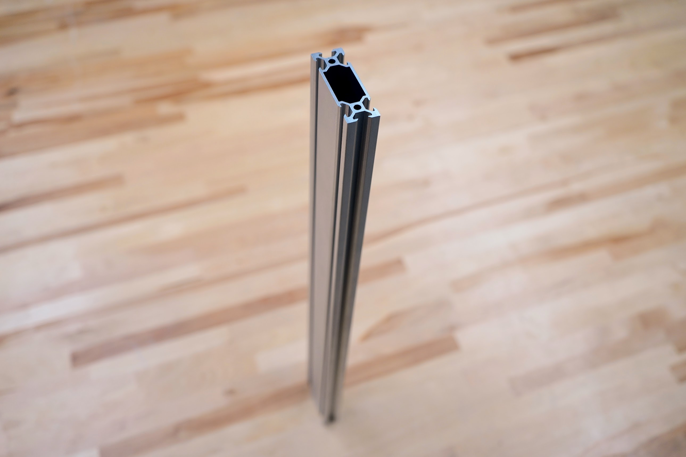
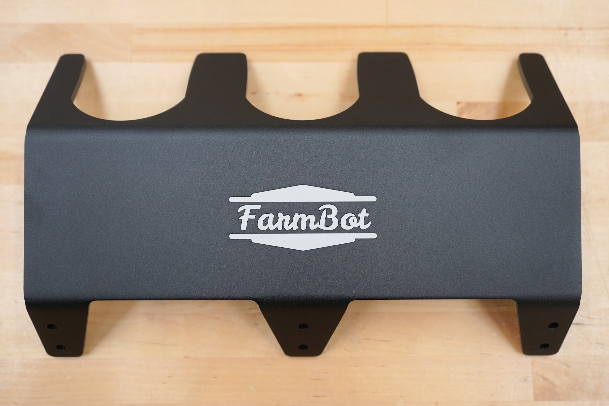
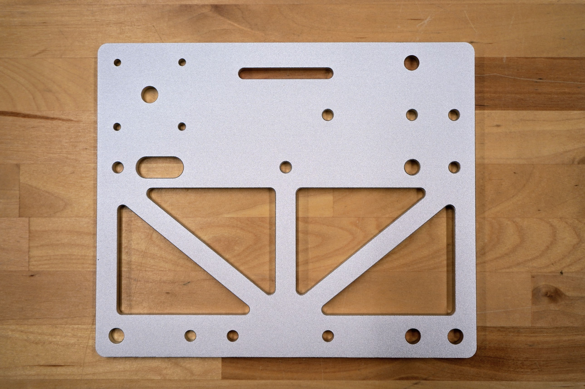
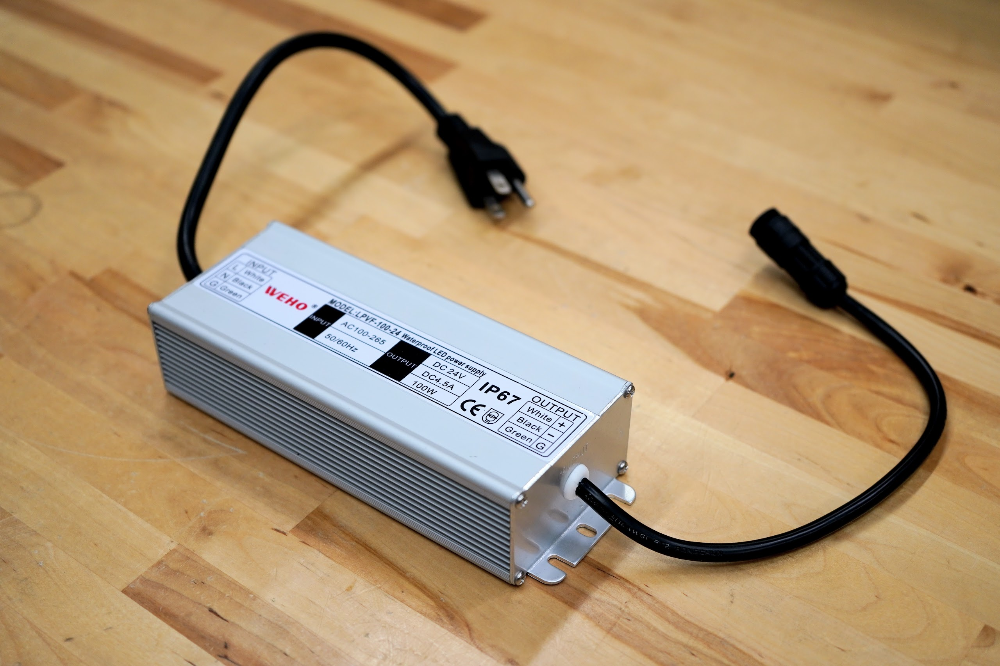
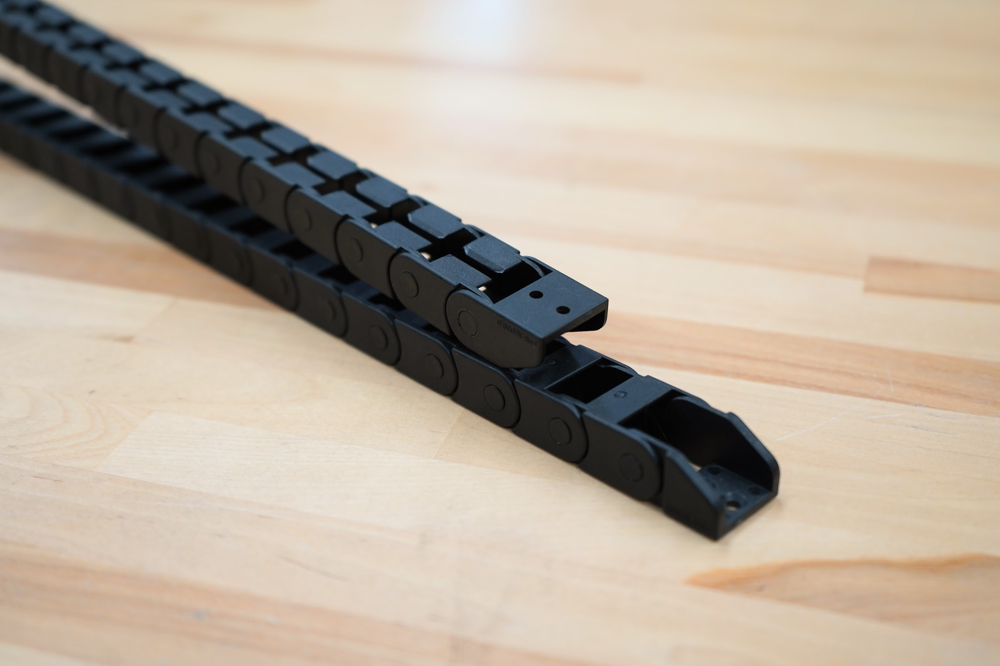

# Pre-assembly

FarmBot Genesis and Genesis (XL) v1.7 now come 90% pre-assembled in the box, significantly reducing the setup time required by the end user to just 3 hours for a Genesis kit and 4 hours for a Genesis (XL) kit. Major pre-assemblies include: the left gantry column with solenoid valve and electronics box, the right gantry column, the cross-slide and z-axis with UTM, all of the tools, and X and Y cable carriers with pre-loaded cables and tubing.

# Track extrusions

New in this version of FarmBot Genesis are completely redesigned [[track extrusions]]. These new extrusions are less than half the weight of the previous track extrusions and are designed to mount directly on top of a wood raised bed without the need for track joining or end plates. The new design also removes the need for separate plastic cable carrier supports, instead relying on an integrated wooden cable carrier support attached to the side of the raised bed.

This new track design is much easier and faster to assemble than previous versions of the Genesis tracks due to the significant reduction in part count. The new design also saves significantly on manufacturing cost and shipping weight and volume.

# Gantry wheel plates

Accompanying the new track extrusions are a new version of the [[gantry wheel plates]]. These new plates are significantly lighter than previous versions thanks to a more compact shape and the addition of two large cutouts. The new wheel plates now include holes for only 3 wheels on the top and two wheels on the bottom, allowing FarmBot to more easily move over track joints and debris, while also reducing part count, manufacturing cost, and overall weight.

# Gantry columns

The [[gantry column]] extrusions have been redesigned to save weight, provide a cleaner aesthetic, and make belt installation easier by removing the center two V slots in favor of a single, larger center cavity.

# Toolbays

The [[3-slot toolbays]] have been redesigned to save weight while providing slightly improved geometry for UTM access. Both kits now include just two 3-slot toolbays.

# Cross-slide plate

Reduced the number of wheels mounted to the [[cross-slide plate]] and added weight-saving cutouts.

# 100 watt power supply

Switched to a 100 watt [[power supply]], still providing ample power for all of FarmBot's core capabilities while reducing cost and weight.

# X-axis cable carrier

Switched to a smaller and lighter [[X-axis cable carrier]], further improving movement dynamics along the X-axis. This change also required a new [[30mm cable carrier mount]].

# Miscellaneous

* Added weight-saving cutouts to the [[left gantry corner bracket]] and [[right gantry corner bracket]].
* Made the tab on the [[belt clips]] narrower.
* Replaced individual wrenches with a [[5.5mm and 8mm combo wrench]].
* Replaced the black oxide Phillips drive wood screws with stainless steel [[T25 wood screws]].
* Included a [[T25 bit]] and [[T10 bit]] as assembly tools.
* Added [[M5 x 4mm setscrews]] for use with nut bars to align track extrusions end-to-end.
* Changed the material of the [[90-degree barb]] to brass.
* Switched to smaller and lighter cardboard edge protectors.
* Reduced the number of post-assembly extra parts.
* Switched all drop-in tee nuts to [[10mm nut bars]].
* Reduced the number of [[60mm horizontal cable carrier supports]] on the gantry main beam to 5 per extrusion.
* Removed the original weeder in favor of only including the powered rotary tool.
* Removed the jumper wires, peripheral leads, PTFE tape, 2mm hex driver, 2.5mm hex key, 5.5mm nut driver, 8mm nut driver, second seed tray and bin, and crop stickers from the kit.
* Combined the getting started guide and camera calibration cards into a single double-sided card.
