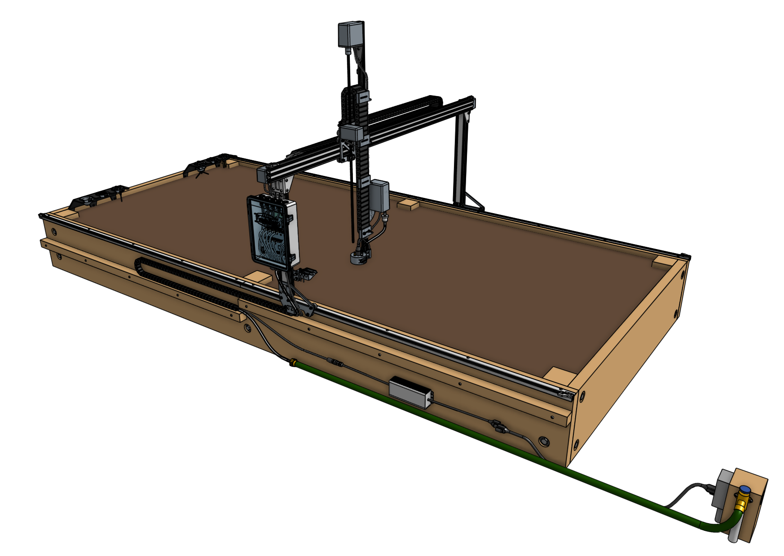
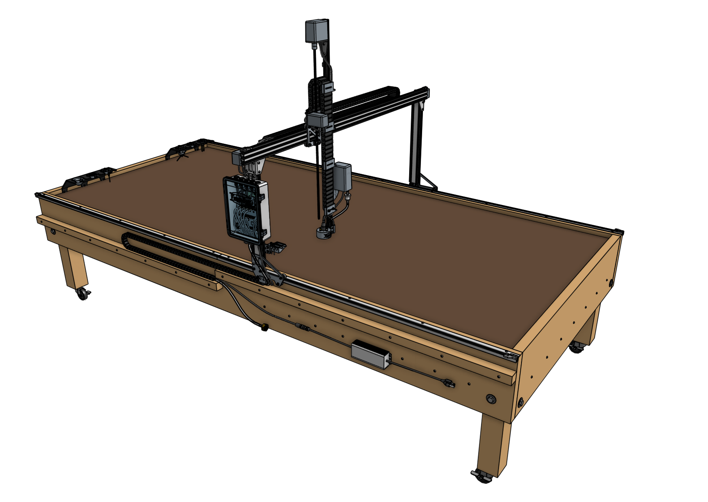
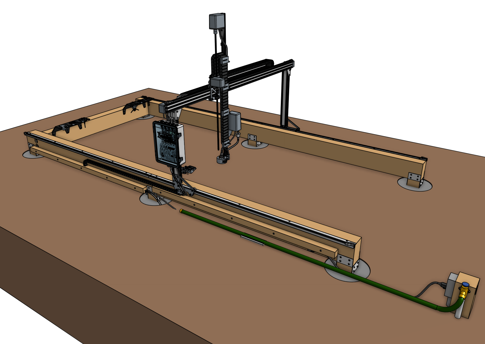

FarmBot's tracks need to be attached to **supporting infrastructure** such as a typical raised garden bed. Where you decide to install your FarmBot will determine how you setup your tracks and therefore what type of supporting infrastructure you need.





In the next sections we offer reference designs for building four types of supporting infrastructure: a **fixed raised bed**, a **mobile raised bed**, **wood posts**, and **pier block supports**. However, not every type of infrastructure is suitable for all of our kits. Refer to the table below to see our recommendations.

|<i></i>             |Genesis             |Genesis (XL)|
|--------------------|:------------------:|:-------------------------------------------:|
|Fixed Raised Bed    |:heavy_check_mark:  |:heavy_check_mark:                           |
|Mobile Raised Bed   |:heavy_check_mark:  |:no_entry:                                   |
|Wood Posts          |:heavy_check_mark:  |:heavy_check_mark:                           |
|Pier Block Supports |:heavy_check_mark:  |:heavy_check_mark:                           |

# Maximum size

We recommend building your supporting infrastructure as large as possible to get the most value out of your FarmBot. See the [economies of scale](intro/high-level-overview.md#economies-of-scale) section for more information on maximizing FarmBot value.

If you are going to modify on of our reference designs, or build supporting infrastructure of your own design, use the dimension guidelines below to ensure compatibility with your FarmBot.

|FarmBot      |Outer Infrastructure Width|Outer Infrastructure Length|
|-------------|--------------------------|---------------------------|
|Genesis      |1.36m (53.5") max         |3m (118") recommended
|Genesis (XL) |2.86m (112.5") max        |6m (236") recommended





# What's next?

 * [Fixed Raised Bed](supporting-infrastructure/raised-bed.md)
 * [Mobile Raised Bed](supporting-infrastructure/mobile-raised-bed.md)
 * [Wood Posts](supporting-infrastructure/wood-posts.md)
 * [Pier Block Supports](supporting-infrastructure/pier-block-supports.md)
