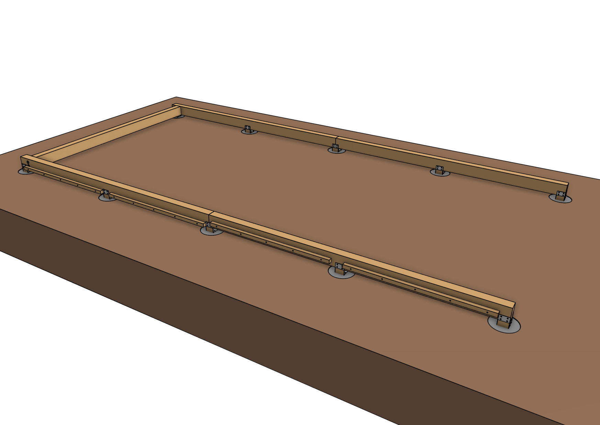
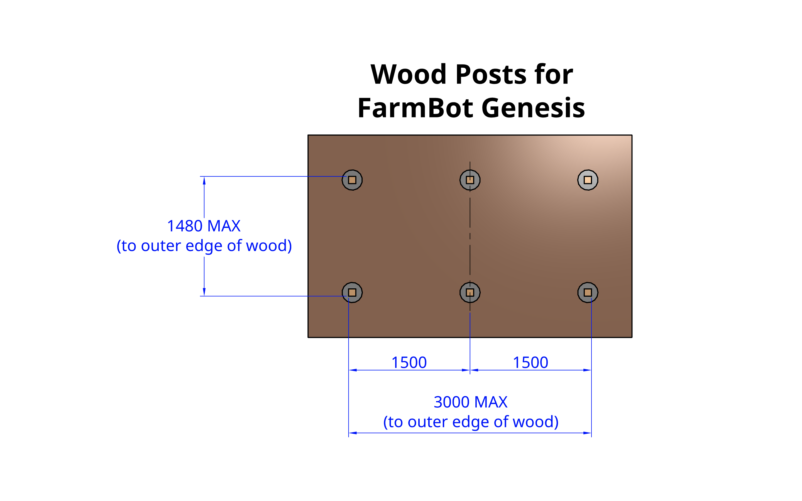
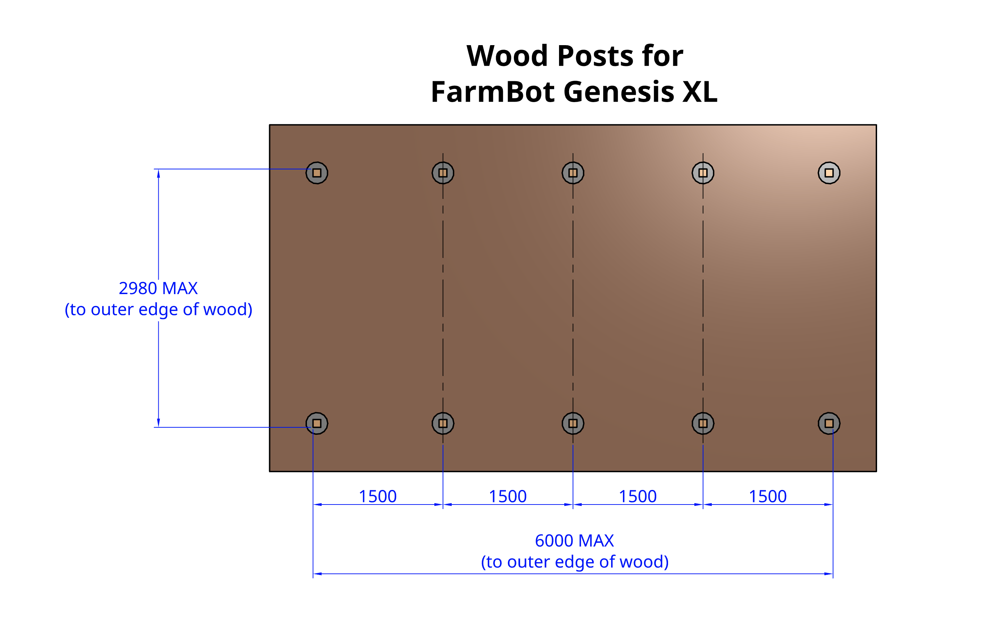
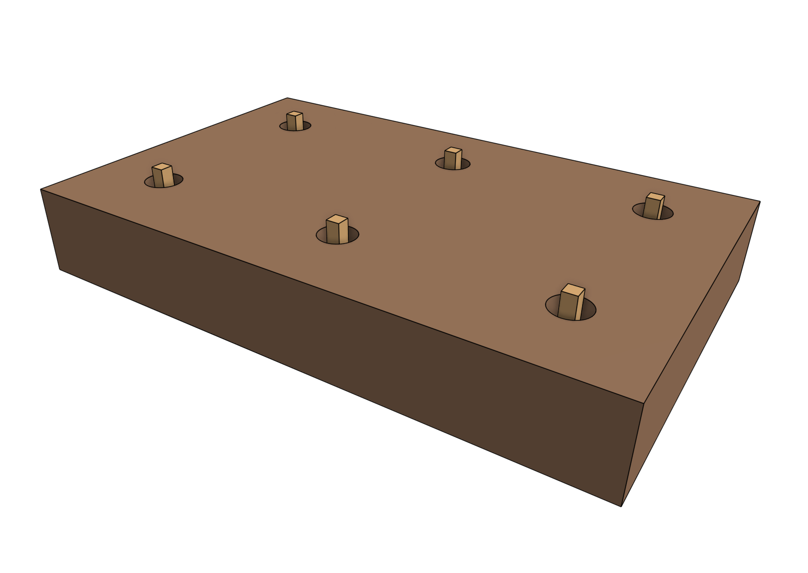
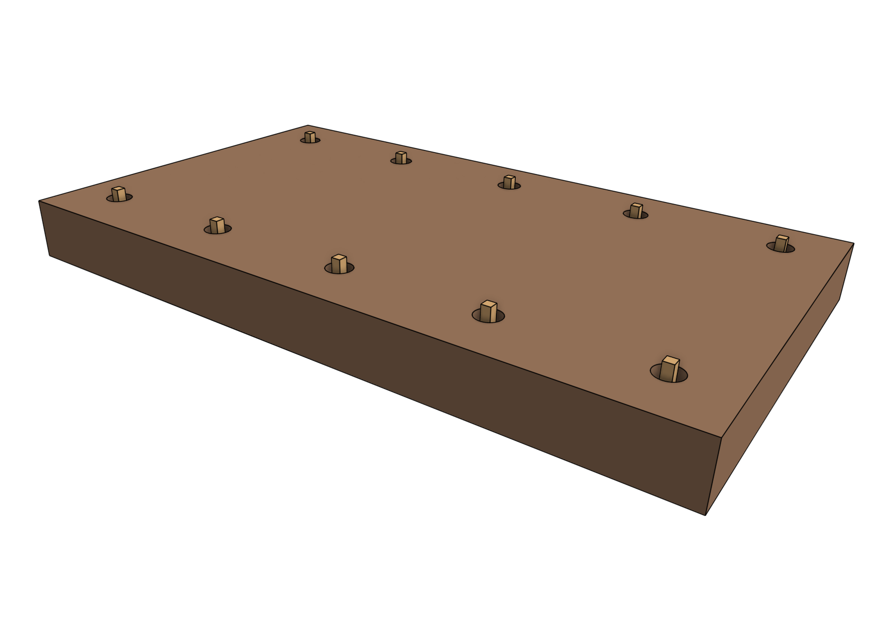

As an alternative to [building a full raised bed](raised-bed.md), you may consider mounting your FarmBot to simple **wood posts** buried or cemented in the ground.





# Step 1: Dig post holes

Dig post holes approximately 400mm deep using a shovel, auger, post hole digger, pick axe, and/or other appropriate gardening tools according to the spacing diagram shown below. **Keep in mind that the outer dimensions of your supporting infrastructure must not exceed [the maximum bed size](raised-bed.md#maximum-raised-bed-size) for your FarmBot**.





# Step 2: Install posts

Cut and insert 500mm **pressure treated wood posts** into each hole. The top of the posts should protrude 60mm to 100mm out of the ground.





# Step 3: Bury or cement the posts in place

Once you have positioned the posts, bury them or pour concrete in the holes. Then double check all of the alignments and spacing before the soil settles or the concrete cures. Refer to the diagrams above for recommended dimensions.





# What's next?

 * [Tracks](../tracks.md)
