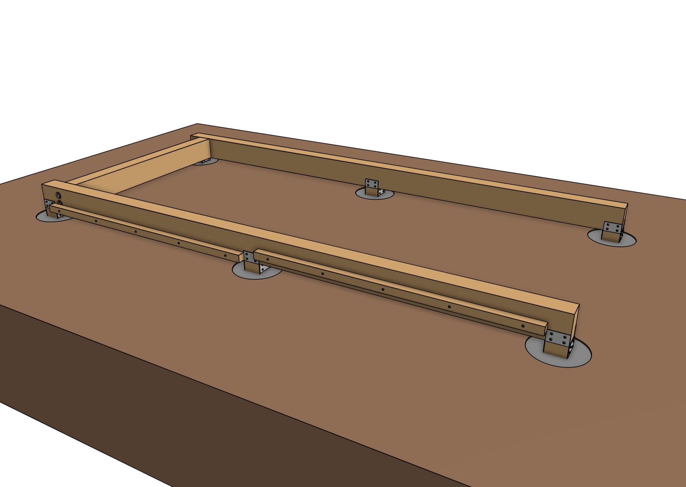
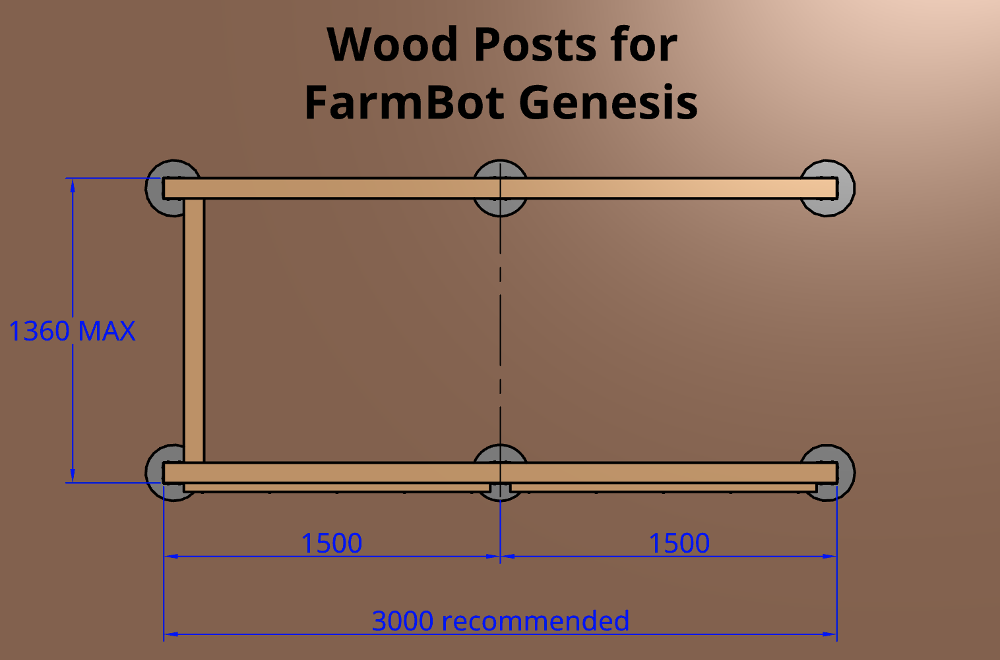
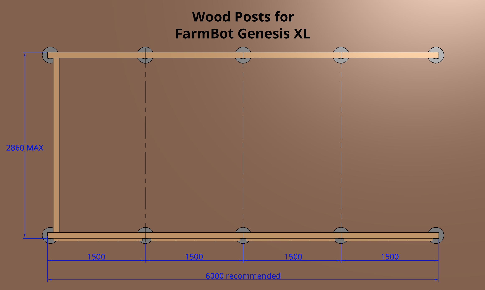

As an alternative to [building a full raised bed](raised-bed.md), you may consider mounting your FarmBot to simple **wood posts** buried or cemented in the ground and topped with wood beams.





# Determining bed size

We recommend building your supporting infrastructure as large as possible to get the most value out of your FarmBot, while making sure you do not exceed the [maximum size limit](../supporting-infrastructure.md#maximum-size). This will ensure you get the most value out of your FarmBot without building unnecessarily large, which can add cost.

The reference designs shown on this documentation page are for a **maximally sized** wood post infrastructure for the stock Genesis and Genesis (XL) kits. The outer dimensions (where the tracks will be mounted) will be 1.36m wide by 3m in length for Genesis, and 2.86m wide by 6m in length for Genesis (XL), with the cable carrier support adding an additional 0.04m to the total width.

If you are designing for a smaller installation, you will need to modify the dimensions of the lumber and post hole layouts.

{%
include callout.html
type="cube"
title="View the CAD model"
content="The [CAD model of this supporting infrastructure](https://cad.onshape.com/documents/073bdf5dd4d58b5100ca194d/v/797df78c9da2ef7e23a1a23b/e/bc6c881b87412ac1872d62b2?configuration=List_NCIWUPW54UcW8w%3DConcrete&renderMode=0&uiState=65694073d4c3ca435daa74f8) is **open-source** (products). You are free to view, copy, and modify the design as needed."
%}

# Step 1: Acquire materials

## Genesis (1.36m x 3m)

|Qty|Component                                     |$/Unit |Subtotal|
|---|----------------------------------------------|------:|-------:|
|6  |Posts (90mm x 90mm x 500mm)                   |$3.00  |$18
|2  |Track supports (90mm x 140mm x 3000mm)        |$15.00 |$30
|1  |Toolbay support (90mm x 140mm x 1180mm)       |$10.00 |$10
|2  |Cable carrier supports (40mm x 40mm x 1365mm) |$3.00  |$6
|6  |Post beam brackets                            |$5.00  |$30
|4  |M10 x 200mm lag screws                        |$0.75  |$3
|4  |M10 washers                                   |$0.25  |$1
|96 |T25 x 25mm wood screws                        |$0.05  |$5
|10 |T25 x 75mm wood screws                        |$0.10  |$1
|1  |Sealer, stain, or polyurethane (optional)     |$20.00 |$20
|1  |Concrete for 6 post holes (optional)          |$20.00 |$20
|   |**TOTAL**                                     |       |**$144**

## Genesis XL (2.86m x 6m)

|Qty|Component                                     |$/Unit |Subtotal|
|---|----------------------------------------------|------:|-------:|
|10 |Posts (90mm x 90mm x 500mm)                   |$3.00  |$30
|4  |Track supports (90mm x 140mm x 3000mm)        |$15.00 |$60
|1  |Toolbay support (90mm x 140mm x 2680mm)       |$15.00 |$15
|4  |Cable carrier supports (40mm x 40mm x 1365mm) |$3.00  |$12
|10 |Post beam brackets                            |$5.00  |$50
|4  |M10 x 200mm lag screws                        |$0.75  |$3
|4  |M10 washers                                   |$0.25  |$1
|160|T25 x 25mm wood screws                        |$0.05  |$8
|20 |T25 x 75mm wood screws                        |$0.10  |$2
|1  |Sealer, stain, or polyurethane (optional)     |$20.00 |$20
|1  |Concrete for 10 post holes (optional)         |$30.00 |$30
|   |**TOTAL**                                     |       |**$231**

# Step 2: Dig post holes

Dig 450mm deep post holes according to the spacing diagram shown below.





# Step 3: Install posts

Cut and insert 500mm **pressure treated wood posts** into each hole. The top of the posts should protrude 50mm out of the ground.





# Step 4: Bury or cement the posts in place

Once you have positioned the posts, bury them or pour concrete in the holes. Then double check all of the alignments and spacing before the soil settles or the concrete cures.



# Step 5: Attach the track supports

Attach **post beam brackets** to the top of the posts using **25mm wood screws**. Then attach the **track supports** to the brackets using more **25mm wood screws**.



# Step 6: Attach the toolbay support

Position the **toolbay support** 90mm from the end of the **track supports** on the side of the bed where FarmBot's home position will be. Pre-drill and counterbore the track supports for the **M10 washers and lag screws**. Then attach the toolbay support to the track supports using the **M10 washers and lag screws**.



# Step 7: Attach the cable carrier supports

Attach the upper **cable carrier support(s)** to the **track support** using **T25 x 75mm wood screws** or equivalent. The cable carrier support should be positioned on the track where you plan to have your FarmBot's electronics box (the left track when looking at the front of the FarmBot). The top of the support should be positioned 60mm from the top of the track.



Attach the lower **cable carrier support(s)** to the **track support** using **T25 x 75mm wood screws** or equivalent. The top surface should be positioned 20mm or more below the bottom surface of the first cable carrier support.



# Step 8: Seal the wood (optional)

Apply a sealer, stain, or polyurethane to the wood to protect it from the elements.





# What's next?

 * [Tracks](../tracks.md)
