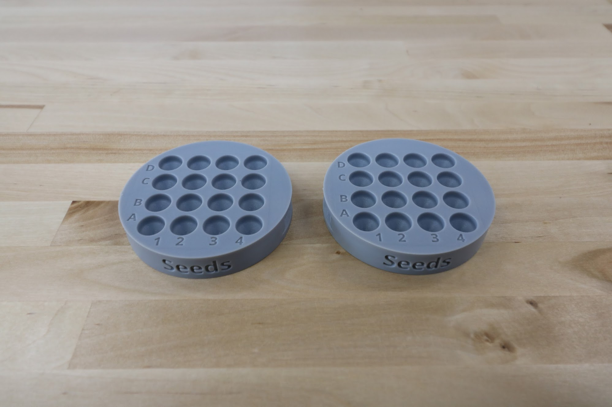
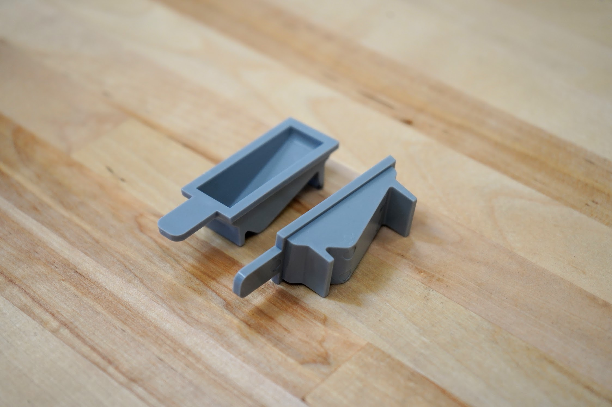
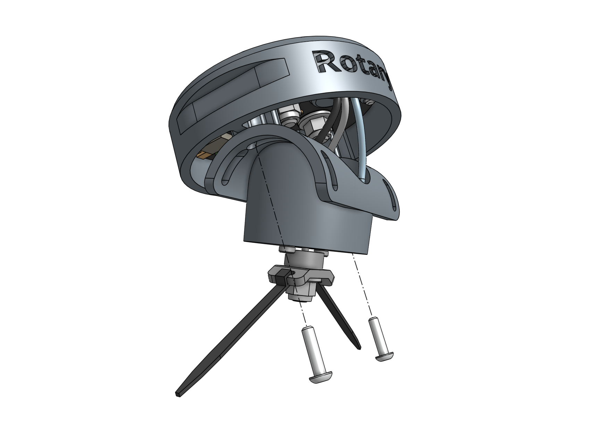

FarmBot Genesis kits come with a **universal tool mounting system**, a variety of **tools** to cover the basics of food production, as well as multiple **toolbays** and various **seed containers**.

# Universal Tool Mount

The **Universal Tool Mount**, or **UTM**, allows FarmBot Genesis to automatically switch tools in order to perform different operations. It features:

* 3 strong neodymium ring magnets to magnetically hold tools in place.
* 3 ports for water, vacuum air, and other liquids/gases to pass through from the UTM to the tool.
* 12 [[pogo pins]] that make electrical connections with tools.







# Seeder

The **seeder tool** works by using a [[vacuum pump]] to suction-hold a single seed at the end of a **needle**. Different sized **luer lock needles** can be used for different sized seeds to improve performance and realibility of seeding.

|Size  |Gauge|Inner Diameter |Good for                 |
|------|-----|---------------|-------------------------|
|Large |16   |1.35mm (0.053")|Large seeds (eg: pumpkin)
|Medium|19   |0.83mm (0.032")|Most seeds
|Small |22   |0.48mm (0.019")|Small seeds (eg: lettuce)

Once you've selected a needle, attach it to the [[luer lock adapter]] with a **quarter turn**. At any time you can quickly swap the needle out for another size or replace a damaged one.

{% include gallery.html images='

<iframe width="100%" src="https://www.youtube.com/embed/nXFdJIQaQB4" frameborder="0" allow="accelerometer; autoplay; clipboard-write; encrypted-media; gyroscope; picture-in-picture" allowfullscreen title="FarmBot YouTube video"></iframe>
' %}



# Seed containers



We offer the following types of seed containers, each optimized for different purposes.

## Seed bin

The [[seed bin]] is for holding large amounts of one type of seed. This is best used when planting many plants of the same crop, for example: when growing microgreens. To use a seed bin, simply fill it with seeds and slide it into the toolbay.

If desired, you can mix a variety of seed types into one seed bin and have FarmBot plant whatever it happens to grab. Keep in mind that FarmBot will have no way of knowing which seeds it grabs, so only use this technique when you will be taking care of all those plants identically.

## Seed tray

The [[seed tray]] has 16 small wells for holding seeds. This is best used when planting many different crops, and when the number of seeds per planting location needs to be strictly controlled.

## Seed troughs

The [[seed troughs]] are small seed containers that are stored in the [[seed trough holder]], which is mounted on the gantry. This allows FarmBot to bring seeds with it along the x-axis, reducing the time to sow an entire bed.

# Watering Nozzle

The **watering nozzle** accepts a concentrated stream of water coming from the [[UTM]] and turns it into a gentle shower for your plants.

{% include gallery.html images='

<iframe width="100%" src="https://www.youtube.com/embed/xh7imhENpLQ" frameborder="0" allow="accelerometer; autoplay; clipboard-write; encrypted-media; gyroscope; picture-in-picture" allowfullscreen title="FarmBot YouTube video"></iframe>
' %}

# Soil Sensor

The **soil sensor** works by driving the tool vertically into the soil so that the soil properties can be read by the [[soil sensor PCB]].

{% include gallery.html images='

<iframe width="100%" src="https://www.youtube.com/embed/p6CPnJoHf8E" frameborder="0" allow="accelerometer; autoplay; clipboard-write; encrypted-media; gyroscope; picture-in-picture" allowfullscreen title="FarmBot YouTube video"></iframe>
' %}

# Rotary Tool

The **rotary tool** features a 24 volt DC motor, interchangeable implements, and an adjustable motor angle allowing FarmBot to perform light duty weed whacking, soil surface milling, and drilling operations.



This tool, and FarmBot in general, is designed for removing weeds early and often such that the weeds are always **small, young, and fragile**, and therefore easily removed.

What makes this possible is FarmBot's diligence. FarmBot has 24 hours a day to maintain your garden meticulously. It can be configured to remove weeds every single day that a human would never waste their time with. This prevents weeds from even having a chance at becoming a real problem.

If you configure FarmBot well, you will never even notice weeds in your garden because they will never have a chance to survive beyond germination. Over time, the number of weed seeds in your growing area will approach zero.



## Safety considerations

The Rotary Tool's motor is fairly low powered relative to other common household tools and garden equipment:

|Equipment|Power (watts)|
|---|---|
|FarmBot Genesis Rotary Tool|Less than 10|
|Hand-held Dremel tool|100+|
|Electric weed trimmer|150 to 300|

However, even though the tool is fairly low powered, some commonsense precautions should be taken when using the tool:

- Do not connect or disconnect the tool from the UTM by hand when the FarmBot is powered on.
- Do not change the tool's implement (drill bit, for example) while it is mounted to the UTM.
- Keep hands, feet, hair, and other body parts away from the tool when mounted to the UTM, especially when the tool is powered.
- When the tool is powered, maintain a safe distance and be mindful of debris (rocks, sticks, dirt) that may be kicked up.
- If closer observation is absolutely necessary while the tool is being used, use appropriate protective equipment such as safety glasses, a face shield, and/or protective clothing.

## Changing the motor angle

The angle of the rotary tool's motor can be adjusted +/- 70 degrees to allow for more aggressive weed whacking. To adjust the angle, loosen or remove the two [[M3 x 12mm screws]] holding the motor to the upper half of the tool. Position the motor at the desired angle and retighten the screws.

## Using the shaft extension

In certain configurations of the rotary tool, you may need to use the [[rotary tool shaft extension]] to provide extra distance between the tool itself and the implement being used. To use the shaft extension, remove any implement currently being used. Screw the shaft extension onto the motor and then re-attach the implement.

## Using the drill chuck

The rotary tool can be configured with the included [[rotary tool chuck]] to perform light duty drilling operations with most standard drill bits smaller than 5mm. To use the drill chuck, set the motor angle to vertical and remove any implement currently being used. Then screw the [[rotary tool chuck adapter]] onto the motor, followed by the [[rotary tool chuck]].

# Camera

The **camera** is a borescope style USB camera that is **fully waterproof**. It can be used to take photos for weed detection, phenotyping research, or [time lapse photography](../../extras/mods/take-time-lapse-plant-photography.md) of your plants growing.

{% include gallery.html images='

<iframe width="100%" src="https://www.youtube.com/embed/-6rKclV82EQ" frameborder="0" allow="accelerometer; autoplay; clipboard-write; encrypted-media; gyroscope; picture-in-picture" allowfullscreen title="FarmBot YouTube video"></iframe>
' %}



# What's next?

 * [Electronics](electronics.md)
