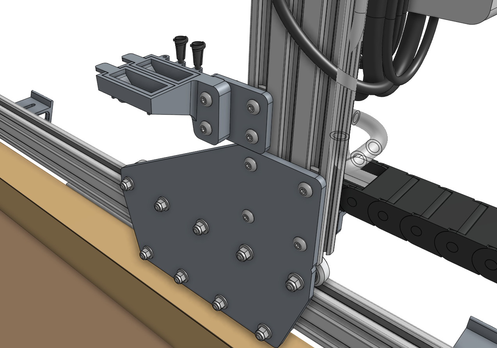

The **seeder tool** works by using a [[vacuum pump]] to suction-hold a single seed at the end of a **needle**.





# Step 1: Selecting a luer lock needle

FarmBot comes with different [[luer lock needle]] sizes so that you can experiment and find the best needle for your needs.

|Size  |Gauge|Inner Diameter |Good for                 |
|------|-----|---------------|-------------------------|
|Large |16   |1.35mm (0.053")|Large seeds (eg: pumpkin)
|Medium|19   |0.83mm (0.032")|Most seeds
|Small |22   |0.48mm (0.019")|Small seeds (eg: lettuce)

Once you've selected a needle, attach it to the [[luer lock adapter]] with a quarter turn. At any time you can quickly swap the needle out for another size or replace a damaged one.

# Step 2: Connect the vacuum tubes and filter



Slide one of the **vacuum tubes** onto the _inlet barb_ of the [[vacuum pump]]. The inlet will be marked with an arrow pointing into the pump. The inlet may be on the left or the right side of the pump depending on when your kit was purchased. Please refer to the arrows on your pump to ensure the tube is connected correctly.

Then slide the [[inline air filter]] onto the end of the first tube and connect the second vacuum tube between the air filter and the [[M5 barb]] on top of the [[UTM]] closest to the FarmBot logo.





# Step 3: Wire up the vacuum pump

Connect the [[z vacuum pump cable]] to the [[vacuum pump]] terminals according to the images below.

* Connect the **clear/silver wire** to the _terminal on the left_ labelled `PE`.
* Connect the **white wire** to the _middle terminal_ labelled `24V`.
* Connect the **black wire** to the _terminal on the right_ labelled `GND`.

If you cannot see the colors of the wires, carefully peel back the black heatshrink covering the whole cable so that you can correctly identify the individual wire colors.





# Step 4: Attach the seed trough holder

Attach the [[seed trough holder]] to the [[seed trough holder mount plate]] using two [[M5 x 30mm screws]] and [[M5 flange locknuts]]. Then mount the assembly to the **left gantry column** using a [[40mm nut bar]] and two [[M5 x 10mm screws]].

Place the two [[seed troughs]] into the holder. Optionally, you may store up to three [[luer lock needles]] in the holder as well.



# Step 5: Understanding the seed containers



We offer the following types of seed containers, each optimized for different purposes.

## Seed bins

The [[seed bins]] are for holding large amounts of one type of seed. This is best used when planting many plants of the same crop, for example: when growing microgreens. To use a seed bin, simply slide it into the **toolbay** and fill it with seeds. Then run a planting sequence from the web app with the corresponding seed bin sequence and location.

If desired, you can mix a variety of seed types into one seed bin and have FarmBot plant whatever it happens to grab. Keep in mind though that FarmBot will have no way of knowing which seeds it grabs, so only use this technique when you will be taking care of all those plants identically. An example for this again might be when growing microgreens - you can grow three different types in the same area at the same time, all in the same way, without having to do three planting sequences or otherwise treat them differently.

## Seed trays

The [[seed trays]] have 16 small area for holding seeds. They are best used when planting many different crops, and when the number of seeds per hole needs to be strictly controlled.

## Seed troughs

The [[seed troughs]] are small seed containers that are stored in the [[seed trough holder]], which is mounted on the gantry. This allows FarmBot to bring seeds with it along the x-axis, reducing the time to sow an entire bed.

# What's next?

 * [Watering Nozzle](watering-nozzle.md)
