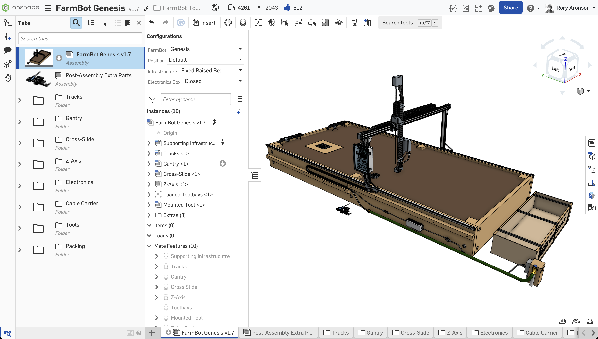

FarmBot Genesis was designed in **[Onshape](https://onshape.com)**, allowing you to have full access to **view**, **copy**, **edit**, and **export** all of the source 3D CAD models for *free* from any computer or mobile device!





# Copying and modifying parts

When you click any of the links above, you will be shown our original copy of the FarmBot CAD files. In order to make any changes, you need to make your own copy. To do so, you will need to first make a free Onshape account. Then you can press “Make a copy” in the top left of the Onshape workspace. Onshape will copy the entire Workspace into a new document (owned by you) which will include all of the parts, drawings, assemblies, and other files.

Please note: when Onshape opens up your copy of the workspace, it might open a Part Studio named “Screw Hole Templates” by default, which is a fairly empty looking Part Studio. To find and open another Part Studio in the Workspace, press the button in the lower left of the screen to open the Tab Manager. Then find the Part Studio you want by looking through the folders or using the search box at the top of the Tab Manager panel.

# Exporting parts

To export a part into another format (such as `.STL` for 3D printing), simply right-click the part and press "Export". Note that you do not need to make a copy of the workspace or have an Onshape account in order to export parts.

# License

The FarmBot CAD models are licensed under the [CC0 Public Domain Dedication](https://creativecommons.org/publicdomain/zero/1.0/).

In short, this means you are free to use the FarmBot CAD models, 2D drawings, and other supporting documents as you please, without attribution or needing to request permission. This includes viewing, copying, modifying, and redistributing the files for any purpose, even commercial purposes. These files come with no warranty, express or implied.
