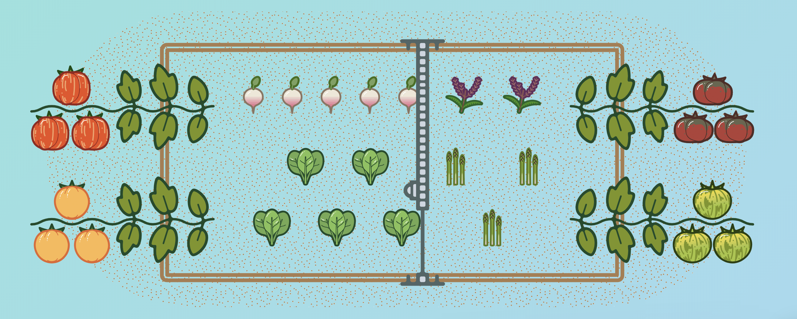

FarmBot is primarily designed for servicing the area defined by the tracks and gantry (ie: within reach of the tool head). However, there are many ways in which FarmBot can take care of plants that are beyond the confines of the tracks and gantry. By using the techniques outlined below, you can maximize output and increase the value you get from your FarmBot.

# Place vining crops at the ends of the bed
Many crops such as Pumpkins, Tomatoes, Squash, and Beans need a substantial amount of area to spread their foliage and fruits over. If you plant a row of these crops at the X-minimum and X-maximum ends of your raised bed, you can train them (by hand) to grow away from the bed and the FarmBot, allowing them to utilize additional area beyond the bed.

As long as your FarmBot can continue to access the root location for watering, this technique can easily double or triple the amount of area your crops can utilize. This increased area allows for more sunlight to be absorbed, and more produce to be grown.



# Use additional solenoid valves to irrigate trees, bushes, and more
By connecting additional solenoid valves, you can easily use FarmBot to irrigate other parts of your yard and garden. For example, you may have a row of fruit trees that need to be watered every week. By connecting a drip line to an extra solenoid valve, you can use the web app's Event scheduler to configure FarmBot to systematically water the trees every week for any duration of time. With a 1-year long Regimen, you could vary the amount of water the trees get based on the season without needing to manually adjust a timer every few months.

This technique could be used to manage the water requirements of trees, bushes, lawns, compost piles, ponds, chicken coops, and even other garden beds. Depending on the water pressure available, you could use additional valves in combination with drip line, small sprinkler heads, soaker hose, and more.
