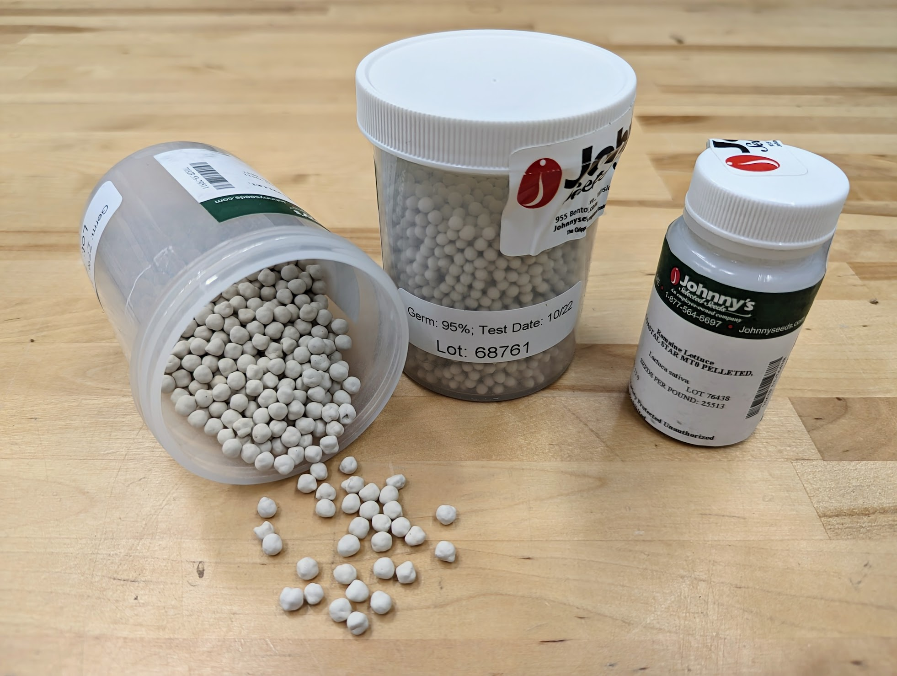
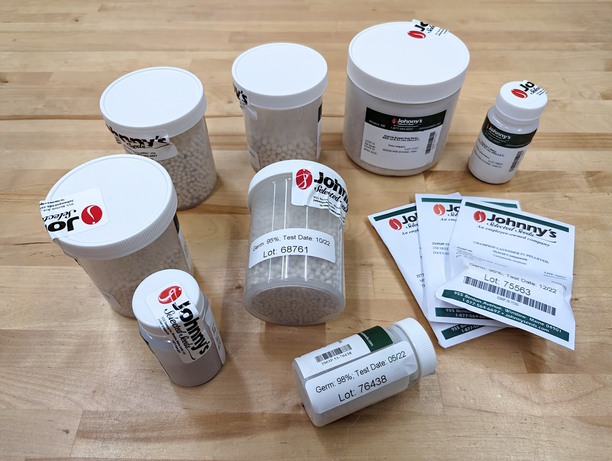
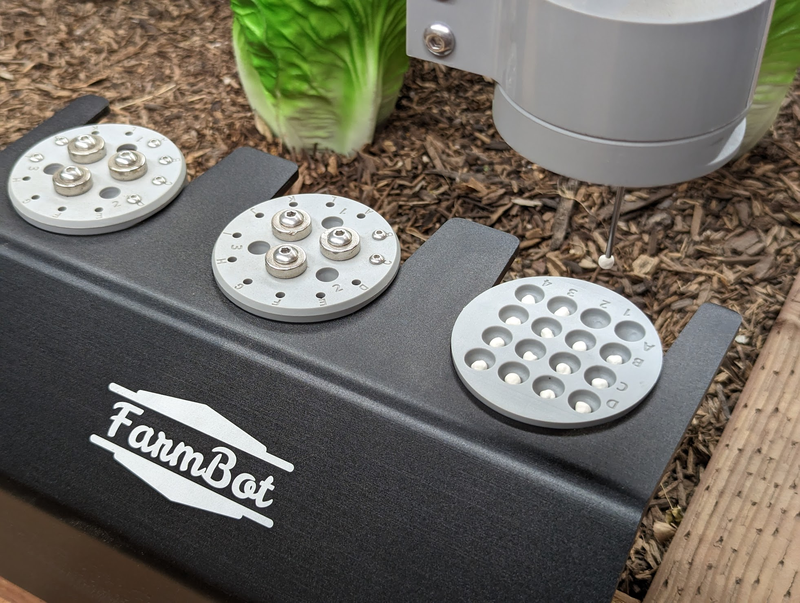
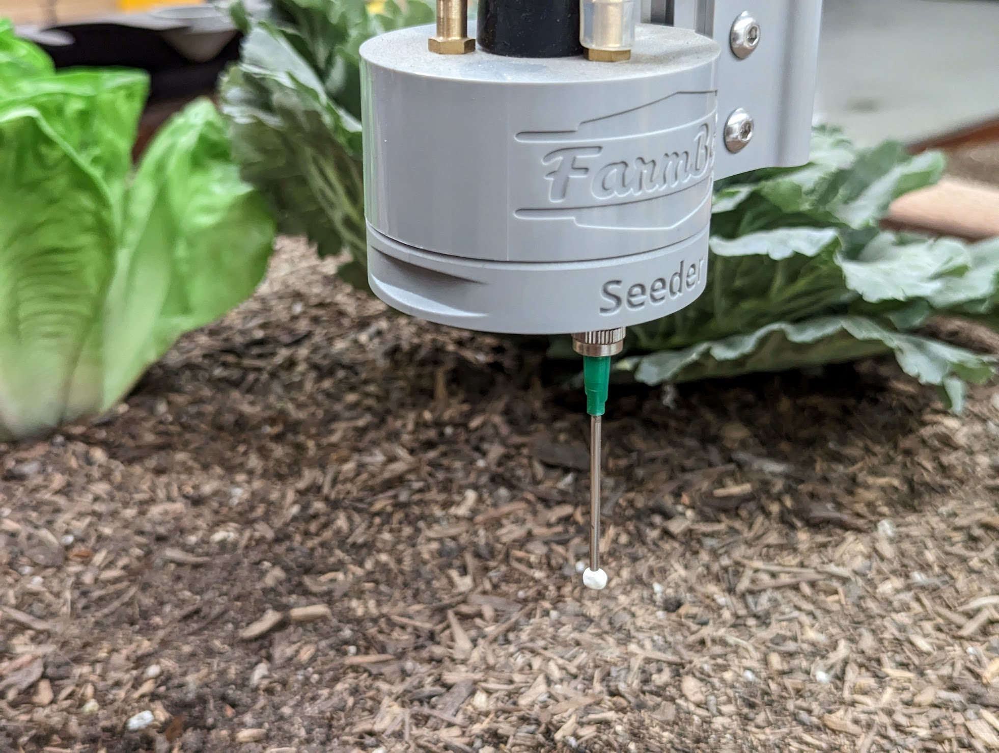

There are three main considerations when choosing **seeds** to plant with FarmBot:

1. [Plant size and shape](#plant-size-and-shape)
2. [Crop requirements](#crop-requirements)
3. [Seed type](#seed-type)

Follow the guidelines below to give yourself the best chance of germination success and a bountiful growing season, while minimizing the likelihood of running into avoidable problems.



# Plant size and shape



The table below shows some common garden crops and whether or not they are recommended for use with FarmBot. Recommendations are based on the size and shape of the plant, and do not take into account a crop's [requirements](#crop-requirements) such as your local climate.

|Category                      |Crop                |Recommended?      |
|------------------------------|--------------------|------------------|
|**Leafy greens**              |[Arugula](https://www.johnnyseeds.com/search/?q=Arugula)          |:heavy_check_mark:|
|                              |[Bok Choi](https://www.johnnyseeds.com/search/?q=Bok+Choi)        |:heavy_check_mark:|
|                              |[Chard](https://www.johnnyseeds.com/search/?q=Chard)              |:heavy_check_mark:|
|                              |[Kale](https://www.johnnyseeds.com/search/?q=Kale)                |:heavy_check_mark:|
|                              |[Spinach](https://www.johnnyseeds.com/search/?q=Spinach)          |:heavy_check_mark:|
|                              |[Lettuce](https://www.johnnyseeds.com/search/?q=Lettuce)          |:heavy_check_mark:|
|**Root vegetables**           |[Beets](https://www.johnnyseeds.com/search/?q=Beets)              |:heavy_check_mark:|
|                              |[Carrots](https://www.johnnyseeds.com/search/?q=Carrots)          |:heavy_check_mark:|
|                              |[Onions](https://www.johnnyseeds.com/search/?q=Onions)            |:heavy_check_mark:|
|                              |[Radishes](https://www.johnnyseeds.com/search/?q=Radishes)        |:heavy_check_mark:|
|                              |[Turnips](https://www.johnnyseeds.com/search/?q=Turnips)          |:heavy_check_mark:|
|**Herbs**                     |[Basil](https://www.johnnyseeds.com/search/?q=Basil)              |:heavy_check_mark:|
|                              |[Cilantro](https://www.johnnyseeds.com/search/?q=Cilantro)        |:heavy_check_mark:|
|                              |[Dill](https://www.johnnyseeds.com/search/?q=Dill)                |:heavy_check_mark:|
|                              |[Parsley](https://www.johnnyseeds.com/search/?q=Parsley)          |:heavy_check_mark:|
|**Fruiting**                  |[Strawberries](https://www.johnnyseeds.com/search/?q=Strawberries)|:heavy_check_mark:|
|                              |[Tomatoes](https://www.johnnyseeds.com/search/?q=Tomatoes)        |:warning: See notes about [vining crops](#vining-crops)|
|**Vining**                    |[Beans](https://www.johnnyseeds.com/search/?q=Beans)              |:warning: See notes about [vining crops](#vining-crops)|
|                              |[Cucumbers](https://www.johnnyseeds.com/search/?q=Cucumbers)      |:warning: See notes about [vining crops](#vining-crops)|
|                              |[Melons](https://www.johnnyseeds.com/search/?q=Melons)            |:warning: See notes about [vining crops](#vining-crops)|
|                              |[Pumpkins](https://www.johnnyseeds.com/search/?q=Pumpkins)        |:warning: See notes about [vining crops](#vining-crops)|
|                              |[Squash](https://www.johnnyseeds.com/search/?q=Squash)            |:warning: See notes about [vining crops](#vining-crops)|
|**Tall**                      |[Corn](https://www.johnnyseeds.com/search/?q=Corn)                |:warning: See notes about [tall crops](#tall-crops)|
|                              |[Sunflowers](https://www.johnnyseeds.com/search/?q=Sunflowers)    |:warning: See notes about [tall crops](#tall-crops)|
|**Trees&nbsp;and&nbsp;bushes**|Apples, Peaches, etc|:no_entry: Not recommended because they will grow too large and wide and likely interfere with FarmBot's gantry, even when planted at bed edges.|

## Vining crops

**Vining crops** that grow in an **indeterminate** fashion such as non-dwarf varieties of Tomatoes, Beans, Cucumbers, Melons, Pumpkins, or Squash may cause interference with FarmBot's movements if the plants grow in unexpected directions (eg: over the FarmBot's tracks) or fruit in unexpected locations.

Vining crops may also cause issues with weed detection and removal, with the potential to significantly hinder performance or create false detections.





## Tall crops

**Tall crops** such as Corn or Sunflowers that will grow to exceed the ~0.6m (~2ft) height of the gantry are not recommended to be grown in the main area of the FarmBot's raised bed. Planting such crops in this space may prevent FarmBot from moving, or the FarmBot may destroy the plants once they are too tall.





# Crop requirements

As with all methods of growing, you will need to choose crops with **requirements** that are **compatible** with your geographic location, FarmBot location, soil conditions, and the time of year. Specific things to consider include:

|Requirement                           |Considerations|
|--------------------------------------|--------------|
|:sunny: Sun                           |Is your FarmBot bed located in full sun or partial sun? If indoors, do you have growing lights?|
|:mountain: Soil quality               |What type of soil is in your FarmBot bed? Is it well draining? Is it high in organic matter?|
|:arrow_down: Planting depth           |How deep should the seeds be planted?|
|🌱&nbsp;Transplanting/thinning        |Does this crop need to be transplanted or thinned at a certain age?|
|:droplet: Water                       |How much water does the crop need? Do you have an abundance of water available? What is the average rainfall in your area at this time of year?|
|🍂&nbsp;Recommended&nbsp;season       |Is it the right time of year to plant this crop?|
|:thermometer: Temperature             |What is the average temperature and temperature range in your area at this time of year?|
|:snowflake: Frost                     |Does your area experience frost? Are you planting late enough to avoid the last frost and early enough to avoid the first frost?|
|:tornado: High winds                  |Does your area experience high winds? Are you attempting to grow taller crops that could be blown down?|
|:bird: Birds and animals              |Are there birds or other animals in your area that may eat your crops before you do?|
|:bug: Insects and diseases            |Are there common insects or diseases in your area that may harm your crops?|



# Seed type

FarmBot can take care of plants from **seed** as well as from **seedlings**, **bulbs**, and **tubers**. However, depending on what you're starting with will determine the available methods of planting.



|<i></i>            |Planting with FarmBot |Manual planting   |
|-------------------|----------------------|------------------|
|Pelleted seeds     |:heavy_check_mark:    |:heavy_check_mark:|
|Non-pelleted seeds |:warning:             |:heavy_check_mark:|
|Seedlings          |:no_entry:            |:heavy_check_mark:|
|Bulbs              |:no_entry:            |:heavy_check_mark:|
|Tubers             |:no_entry:            |:heavy_check_mark:|

## Pelleted seeds

FarmBot's seeding capability utilizes a [[luer lock needle]] and [[vacuum pump]] to pick up and suction-hold a seed onto the tip of the needle for precise deposition into the soil. Different diameter needles can be used for different seed sizes, where small seeds such as those of Lettuce can be picked up with a smaller needle, while larger seeds such as those of Squash can be picked up with a larger needle.

We recommend using **pelleted seeds** from [Johnny's Selected Seeds](https://www.johnnyseeds.com/featured/pelleted-seeds/). They have a large selection of high quality, [non-GMO](https://www.johnnyseeds.com/about-us/about-our-seed/safe-seed-pledge.html) seeds that are professionally tested, pelleted, and packaged. You may also find pelleted seeds at a local farm supply store or from other online retailers.





## Non-pelleted seeds

If using **non-pelleted seeds**, it is important to select the most optimal needle size and be aware of the following challenges:

* Too many seeds may get sucked onto the needle at once.
* Seeds may get sucked through the needle and clog the vacuum pump.
* Irregular seed surfaces may prevent reliable suction holding power.



## Seedlings, bulbs, and tubers

Some very small or very large seeds as well as **seedlings**, **bulbs**, and **tubers** will not work with FarmBot's automated seeding system, though you can still grow them with FarmBot once they have been **manually planted**.

To manually plant something, first add the plant to your farm designer map in the web app. Then instruct FarmBot to move to the plant location and dispense a very small amount of water to mark the soil. Dig a small hole of the appropriate depth and insert the seedling, bulb, etc by hand in the center of the marked location.
