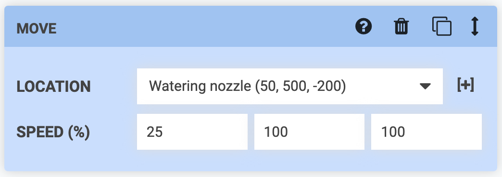
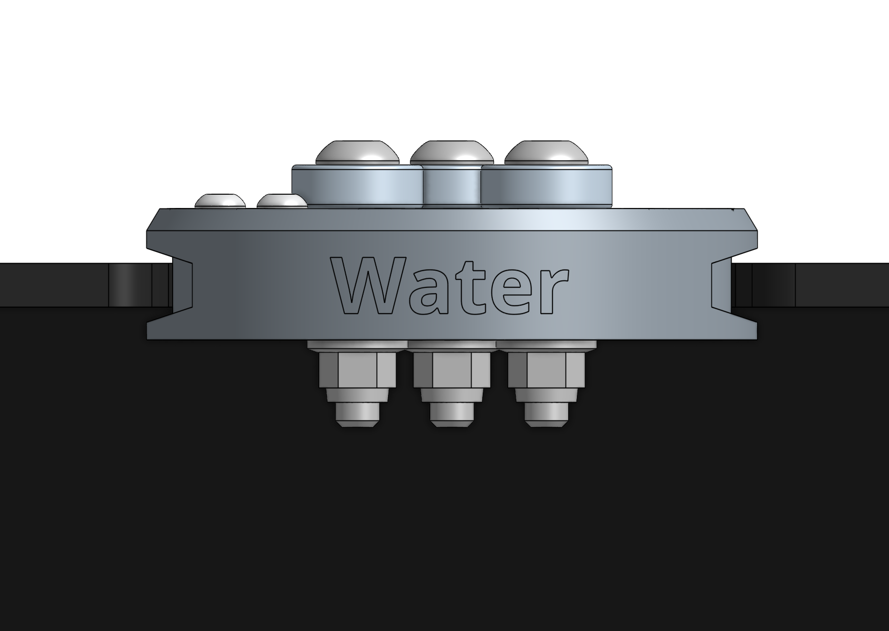
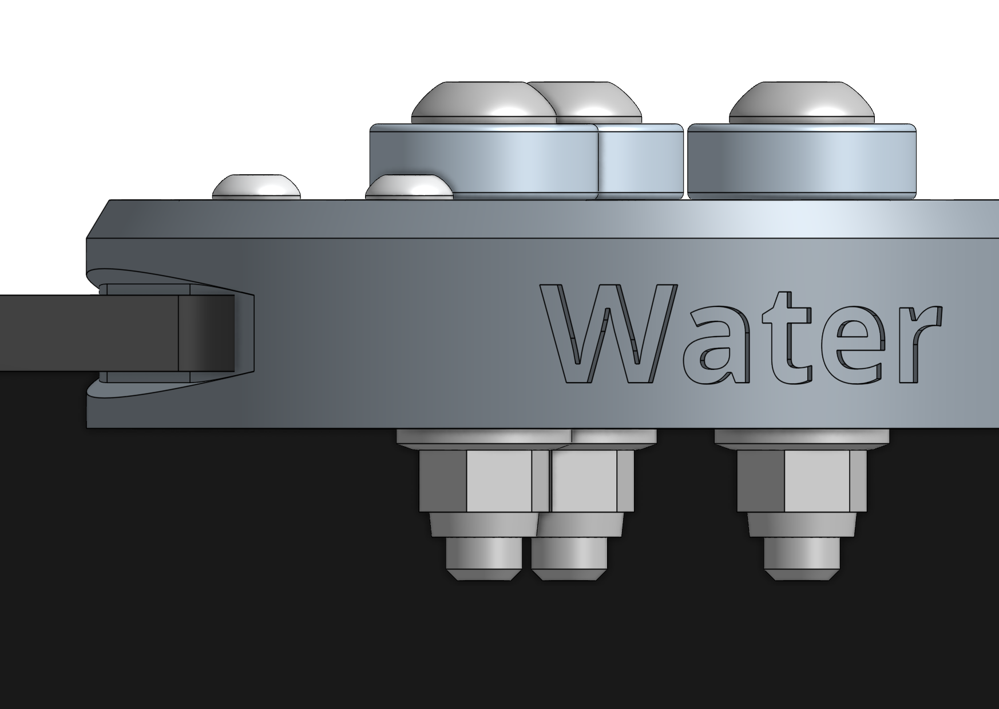
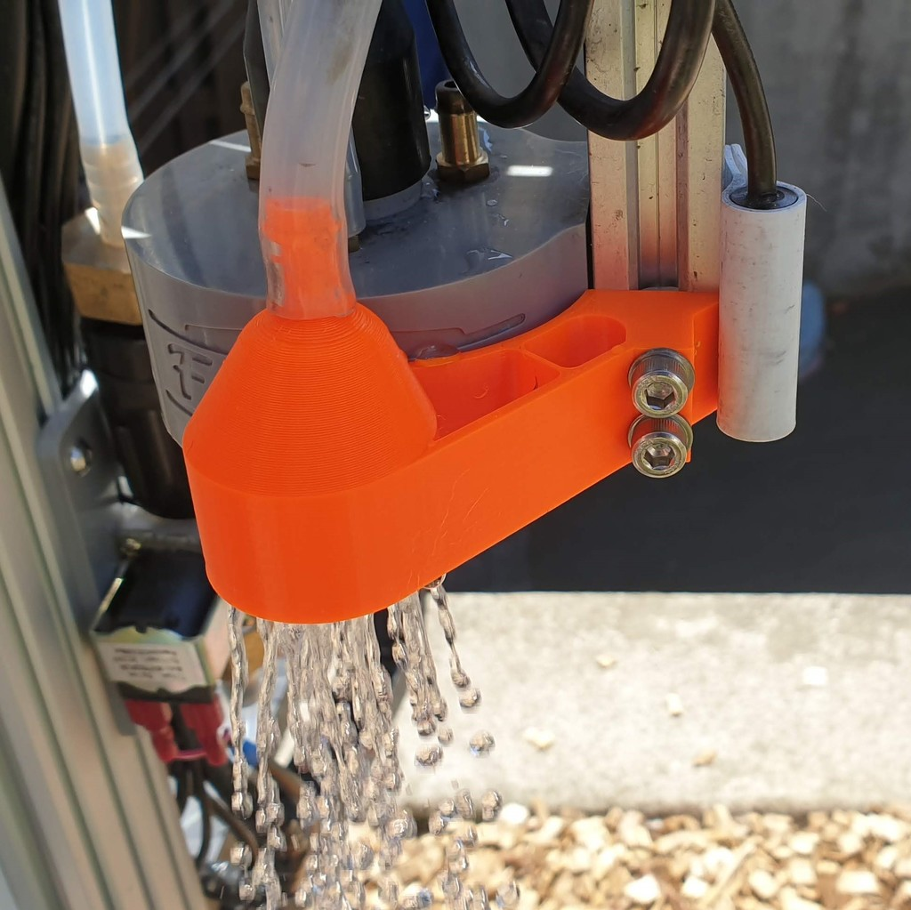

If you are encountering issues with reliably mounting and dismounting tools into the toolbay, try the following troubleshooting steps.

# 1. Check toolbay alignment

The toolbays should be mounted on sturdy wood and must be aligned with FarmBot's axes. If a toolbay is out of alignment, not perfectly level, or not securely attached to the bed, then it will be difficult for FarmBot to mount and dismount the tools due to the interference as the tool goes into and out of the slot.

Unscrew the toolbays and securely reattach them, ensuring they are square with FarmBot's axes. Shims may be required to ensure the toolbays are level. After reattaching the toolbays, you will need to re-set the coordinates of the slots in the app.

# 2. Lower movement speeds

The mounting and dismounting of tools should be performed _slowly_ to allow the magnets to align and attach to the UTM, and to minimize any shaking or jerkiness due to acceleration. When mounting and dismounting, it is recommended to use a **SPEED** of 50% to 25% of the normal speed.

# 3. Check the Z coordinate of the slots

You may need to make slight adjustments to the Z coordinate of your tool slots. The optimal Z position is such that the metal of the toolbay is **centered** within the slots in the sides of the tool whenever the tool is being pulled out of or put back into the slot. This will minimize the chance of interference and friction.



# 4. Clean the UTM and tools

It is possible for dust, soil, and other metallic debris to magnetically attract to the UTM and tool magnets and build up over time. This debris can prevent the UTM from correctly mounting tools.

# 5. Install a permanent watering nozzle

Because watering is the most common activity, mounting and dismounting issues can been solved for watering procedures by adding a **permanently mounted watering nozzle**. The solution shown below, contributed by FarmBot community member ClosedCircuit, can be [downloaded from Thingverse](https://www.thingiverse.com/thing:4534979) and 3D printed.

