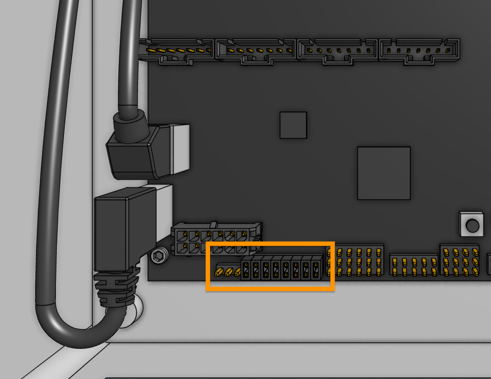
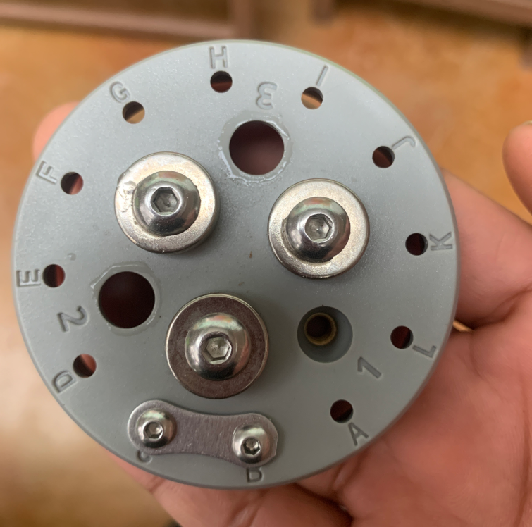

# 1. Ensure the UTM cable is fully connected

Double check that the UTM cable is fully connected in all locations:

- Both the [2x3 and 2x4 connectors must be plugged into the top of the UTM](../../assembly/tools/utm.md#step-2-connect-the-utm-cable). Ensure the connectors are fully seated down onto the [[UTM PCB]] before sliding the rubber shroud over the plastic. Once the shroud is positioned, make sure not to pull on the cable, or the connections may come undone.
- The 90-degree connection between the Y-axis and Z-axis portions of the UTM cable must be fully pushed together and screwed tight. You may need to push the connectors together, tighten the thumbscrew, then push together some more, and then tighten the thumbscrew again.
- The [2x6 connector of the Y-axis UTM cable must be plugged into the Farmduino](../../assembly/electronics.md#step-5-plug-in-the-utm-cable) inside the electronics box.
- There should be eight 1x2 [[shunts]] installed on the pin headers labeled `A` through `H` on the [[Farmduino]], as shown in the image below.

# 2. Clean the UTM's pogo pins

The UTM has 12 spring loaded [[pogo pins]] that make electrical contact with the mounted tool. If these pins get dirty, they can fail to spring back out when a tool is disconnected. This can cause tool verification to fail the next time a tool is mounted because the pins will not be making contact with the tool.

Clean the pogo pins with a small amount of isopropyl alcohol, making sure to fully depress each of the pogo pins a few times with your finger and ensuring they spring back out all the way. You may also consider adding a dry graphite lubricant to each of the pins.

# 3. Double check the tool's jumper link

FarmBot verifies that a tool has been mounted by checking for an electrical connection between pins `B` and `C`. Each tool should have a [[jumper link]] [installed](../../extras/reference/basic-tool-hardware.md#step-2-install-the-tool-verification-jumper-link) that connects pins `B` and `C` together.

If you continue to have issues, you may try repositioning the jumper link to the top of the tool to increase the amount the pogo pins are depressed when the tool is mounted.

# 4. Clean the top of the tool

Dirt and debris on top of the tool such as bird droppings or mud can prevent an electrical connection between the tool and the UTM. Clean the top of the tool with isopropyl alcohol.
