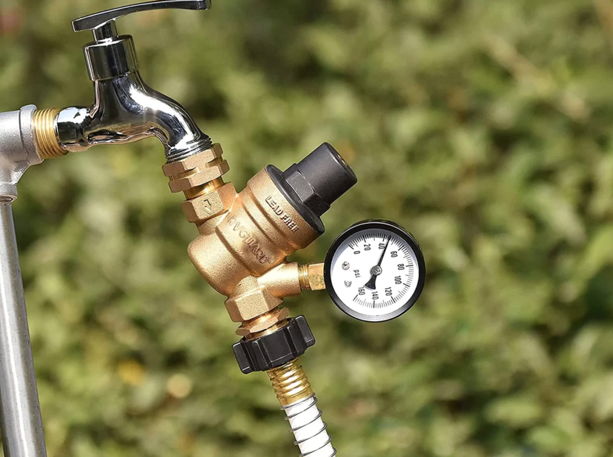
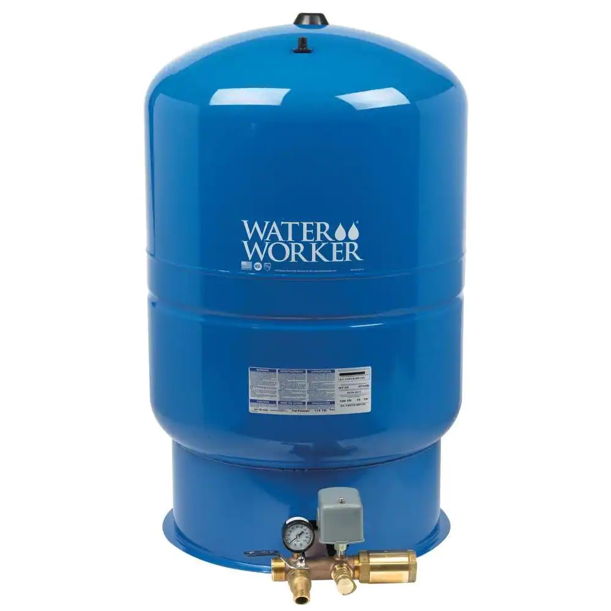

FarmBot is designed to work with typical **municipal water pressure between 40 PSI and 55 PSI (275kPa and 379kPa)**. If the water pressure supplied to the FarmBot is significantly higher or lower than this range, you may experience one of the following issues with the FarmBot watering system.

|**Symptom**|**Problem**|
|-----------|-----------|
|There is leaking at one or more connections between the garden hose and the solenoid valve.|[Pressure is too high](#pressure-is-too-high)|
|The X-axis water tube is getting blown off one or both of the brass barbed adapters.|[Pressure is too high](#pressure-is-too-high)|
|The solenoid valve is not opening when activated, resulting in no water flow.|[Pressure is too low](#pressure-is-too-low)|
|With the solenoid valve activated, water flows only partially through the tubing located in the Y-axis and Z-axis cable carriers, resulting in no water flow to the FarmBot watering nozzle.|[Pressure is too low](#pressure-is-too-low)|
|With the solenoid valve activated, water flows very slowly through the tubing system, resulting in very low flow through the FarmBot watering nozzle.|[Pressure is too low](#pressure-is-too-low)|

# Pressure is too high

The FarmBot comes equipped with a black plastic water [[pressure regulator]]. However, this component only regulates the water pressure _downstream_ of the [[solenoid valve]]. It does not regulate the pressure upstream of the valve.

If the incoming water pressure is much higher than the expected range, the water pressure will need to be reduced to the expected pressure range using an additional water pressure regulator upstream of the FarmBot (before the water reaches any of the FarmBot tubing).

Water pressure regulators are common in the plumbing industry and we suggest getting one with a pressure gauge so that you know what the output pressure is and so that you may control the water pressure getting to the FarmBot water supply tubes. FarmBot Inc does not supply these water pressure regulators, but you can source one
from [Amazon](https://smile.amazon.com/dp/B083HSQMHX) or your local hardware store or RV service shop. We suggest setting the output water pressure to 45 PSI (310kPa).

# Pressure is too low

Too low of water pressure may be caused by installing FarmBot at an elevation significantly higher than the garden hose tap, or if you are using a non-municipal water source such as a rain collection barrel.

To remedy the issue, consider installing a water pump and [pressure tank](https://www.homedepot.com/p/202846485) upstream of the FarmBot to pressurize the incoming water supply to at least 25 PSI (172kPa), or devise another method to supply adequately pressurized water.

