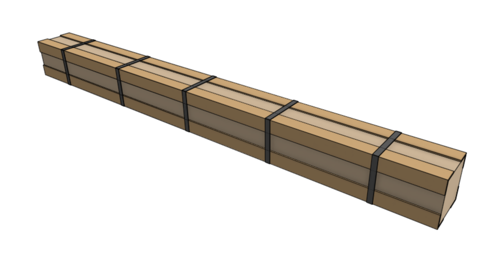

The tables below show the items that should be packed into the **extrusion kit** for each version.

# Genesis packing list

|Item|Sub-packing|Qty|
|----|-----------|---|
|[[Track Extrusion]] (20 x 40 x 1500mm)|Wrapped with recycled kraft paper|4
|[[Gantry Main Beam]] (20 x 60 x 1500mm)|Wrapped with recycled kraft paper|1

# Genesis (XL) packing list

|Item|Sub-packing|Qty|
|----|-----------|---|
|[[Track Extrusion]] (20 x 40 x 1500mm)|Wrapped with recycled kraft paper|8
|[[Gantry Main Beam]] (20 x 60 x 1500mm)|Wrapped with recycled kraft paper|2

# Edge protectors and straps

Add four cardboard **edge protectors** on the four longest edges of the box. Then add five black polystraps.

# Box specifications

|                              |                              |
|------------------------------|------------------------------|
|**Box style**                 |Standard style box
|**Inner dimensions (L x W x H)**|Genesis: 1540 x 120 x 120mm Genesis XL: 1550 x 120 x 140mm
|**Outer dimensions (L x W x H)**|Genesis: 1550 x 130 x 130mm Genesis XL: 1550 x 120 x 150mm
|**Material**                  |Cardboard
|**Color**                     |Brown
|**Printing**                  |Genesis: Genesis Extrusion Kit.pdf Genesis XL: Genesis XL Extrusion Kit.pdf
|**Fill**                      |Recycled kraft paper

