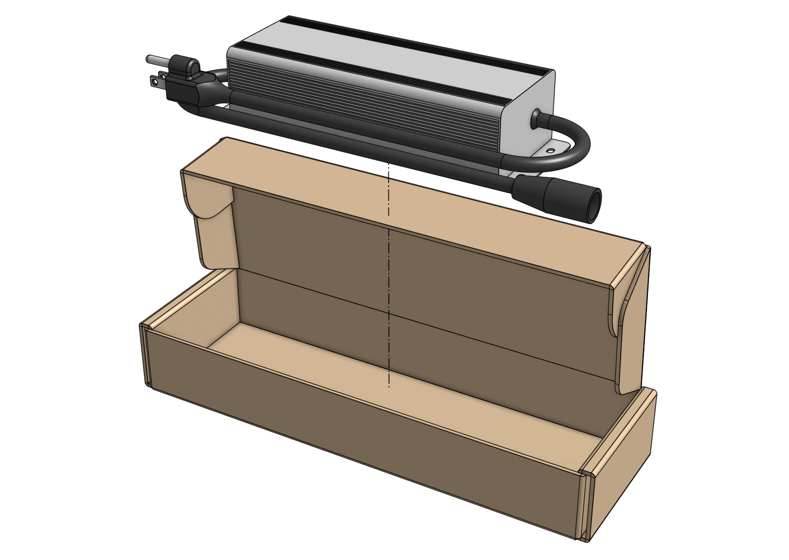
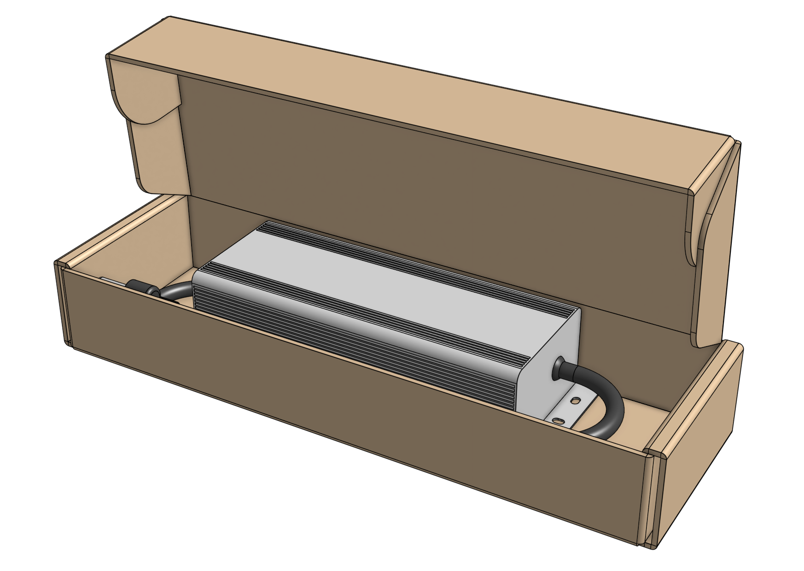
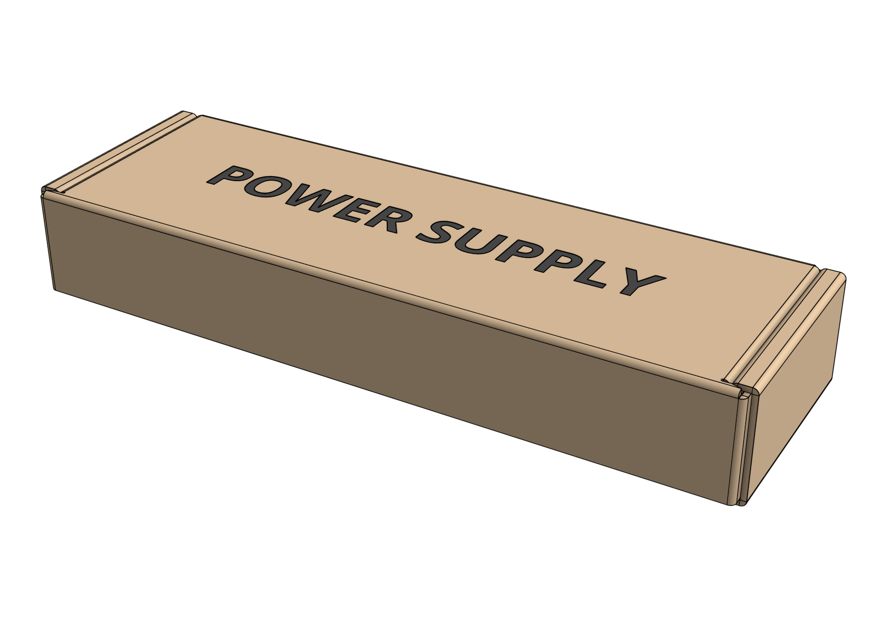

# Packing list

|Item|Qty|
|----|---|
|Power Supply Box|1
|[[Power Supply]]|1

# Step 1: Pack the power supply

Pack the [[power supply]] into the box.



# Step 2: Add fill

Fill remaining space with **recycled kraft paper**.

# Box specifications

|                                |                              |
|--------------------------------|------------------------------|
|**Box style**                   |Top flap (standard FarmBot box design)
|**Inner dimensions (L x W x H)**|
|**Outer dimensions (L x W x H)**|
|**Material**                    |Cardboard
|**Color**                       |Brown
|**Printing**                    |None
|**Fill**                        |Recycled kraft paper

