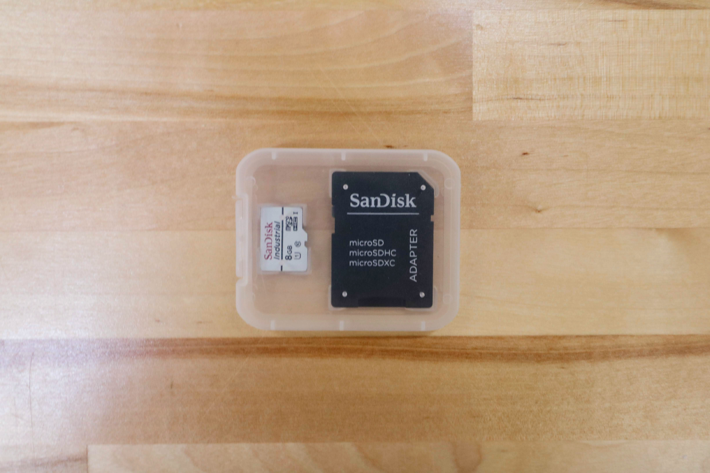

The [[Farmduino]] and [[Raspberry Pi]] are the central components of the FarmBot from an electronic systems perspective. The diagram below shows how the other electronic components connect to these boards, as well as how the two are connected to each other.

The Farmduino microcontroller uses Arduino architecture and it communicates with the Raspberry Pi using a G-code like language. The Farmduino controls the stepper drivers and motors, as well as the UTM and peripherals. The Farmduino provides power and control to all the electronic components of the FarmBot. The board has a layout and connectors that are optimized for FarmBot's various peripherals and motor requirements.

Meanwhile, the Raspberry Pi is the web-connected brain that keeps track of FarmBot's plants, sequences, regimens, events, and settings. Additionally, the Raspberry Pi is responsible for taking photos with the USB camera, and monitoring the push buttons on top of the electronics box via the [[Pi adapter board]].

# Step 1: Prep



Remove the black rubber [[supergland]] from the slot in the bottom of the [[electronics box]].



# Step 2: Connect the peripherals

Connect the following cables to the [[Farmduino]] peripheral connectors:

* [[Y vacuum pump cable]] labelled `VAC` to the connector labelled `VACUUM`.
* [[solenoid valve cable]] labelled `H2O` to the connector labelled `WATER`.
* [[LED strip]] labelled `LED` to the connector labelled `LIGHTING`.





# Step 3: Plug in the stepper motors and rotary encoders

Plug in the `X2`, `Y`, and `Z` [[motor cables]] and [[encoder cables]] to the [[Farmduino]].







# Step 4: Plug in the camera

Plug the [[camera cable]] into the [[Raspberry Pi]]. The exact USB port chosen does not matter.

# Step 5: Plug in the UTM cable

Plug in the [[UTM cable]] to the [[Farmduino]].



# Step 6: Plug the power supply into the Farmduino

Connect the [[power supply cable]]to the **Farmduino's power input**.



# Step 7: Insert the supergland

Insert one half of the **supergland** into the slot in the bottom of the [[electronics box]]. The left-most hole in the supergland should be small (it is for the camera) while the right-most hole should be medium-sized (it is for the power supply).

Organize and position the **cables** into the **supergland**. From left to right, the cables should be: camera, UTM, motors, encoders, peripherals, power supply.

Once the cables are all inserted into the first supergland half, gently insert the second half of the supergland into the slot in the electronics box. Ensure that the flanges of both supergland halves are on either side of the electronics box wall.



# Step 8: Install FarmBot OS

Follow [these instructions](https://software.farm.bot/docs/farmbot-os) on the software documentation hub to install **FarmBot OS** onto the [[micro SD card]].





# Step 9: Equalize the gantry



To equalize the gantry, first ensure that the x-axis motors are unpowered. For first time installation this will always be the case. Then gently push or pull on the gantry **from the middle of the gantry main beam** such that it moves slowly along the tracks about 30cm. This process will remove any torque on the gantry, and ensure it is not crooked.

If you were equalizing the gantry as part of routine maintenance, remember to FIND HOME X after equalization. Otherwise, proceed with the software portion of the setup.

# Step 10: Mount the power supply

Mount the [[power supply]] to your **supporting infrastructure** using four [[wood screws]].



# Step 11: Plug in the power supply

Connect the [[power supply cable]] to the [[power supply]] **output**.



If everything looks good, and you understand the precautions needed around powered electronics, go ahead and plug the [[power supply]] into a **GFCI outlet**.

If an appropriate outlet is not close enough to plug in directly, use an extension cord and the provided [[power cord protector]].







# What's next?

 * [Final steps](final-steps.md)
