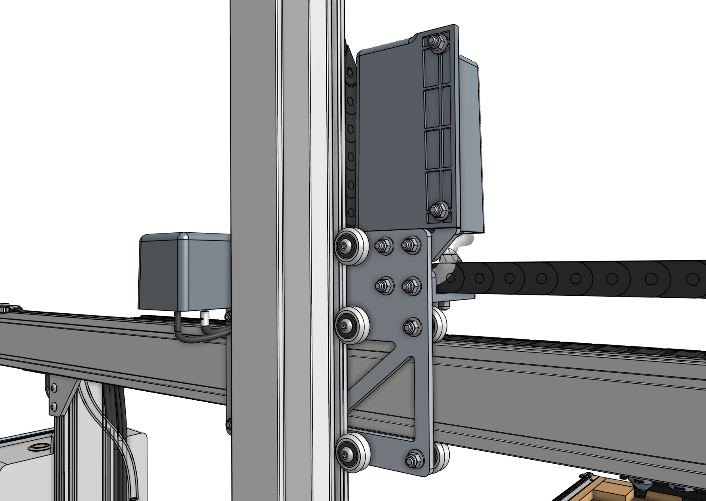

# Packaging

FarmBot Genesis and Genesis (XL) v1.8 are now packaged and shipped in a single box. This consolidation, along with other weight saving changes made throughout the kit, has significantly reduced the amount of single-use materials needed to package the product, reduced overall kit volume, and lowered total shipping weight by approximately 20% compared to v1.7 kits.

# Track extrusions

Building on the success of the simplified track design introduced in v1.7, the v1.8 [[track extrusions]] are now even lighter, more compact, and easier to assemble. Coming in 1m lengths, the new tracks are co-packaged with the rest of the FarmBot kit, further saving cost and shipping weight. Meanwhile, they are now joined together with a nut bar in the _upper_ slot, making it easier to access the setscrews during installation and maintenance.

# Gantry columns

Also building upon v1.7, the new v1.8 [[gantry column]] profiles are now lighter weight, further improving incremental machine performance and contributing to overall weight savings.

# Gantry main beam

New [[gantry main beams]] are now significantly lighter weight without compromising on strength, while offering a refined aesthetic on the front face. The new beams are also now shorter and more numerous (two 0.75m beams for Genesis and three 1m beams for Genesis (XL)) in order to be co-packaged with the rest of the FarmBot kit.

# Extruded cable carrier supports

New extruded [[extruded 40mm horizontal cable carrier supports]] and an [[extruded 40mm vertical cable carrier support]] are designed to slide into the gantry main beam and z-axis extrusion slots. They are lower cost, easier and faster to assemble, reduce total part count, better support and conceal the cables routed through them, and create a diffused look for the LED strip.



# Gantry joining bar

A new [[gantry joining bar]] has been introduced to connect the gantry main beams together while being compatible with the new cable carrier supports. Combined with new [[160mm nut bars]], the main beam assembly retains its needed rigidity and strength.

# Relocated vacuum pump

The [[vacuum pump]] has been relocated to the cross-slide, reducing the weight and size of the Z-axis to improve movements. This change also resulted in the need for a new [[vacuum pump mount]] as well as the elimination of the Z-axis vacuum cable and a revision to the [[Y vacuum pump cable]].

# Smaller Y and Z cable carriers

The [[Y-axis cable carrier]] and [[Z-axis cable carrier]] are now 20mm narrower (15x30 internal size), incrementally improving movements, costs, and shipping weight. These changes also required a new [[cross-slide plate]], [[vertical motor housing]], [[40mm cable carrier spacer block]], [[60mm cable carrier mount]], and [[40mm vertical cable carrier support]].

# Lighter plates and brackets

The [[gantry wheel plates]], [[left gantry corner bracket]], [[right gantry corner bracket]], [[cross-slide plate]], and [[z-axis motor mount]] have all been optimized to be lighter weight and use smaller 40mm nut bars instead of 60mm nut bars for assembly onto extrusions.



# Countersunk UTM magnets

The [[UTM]] (Universal Tool Mount) now uses stronger [[countersunk magnets]] to more securely hold all tools in place. Meanwhile, the rotary tool now uses standard magnets like the other three tools.

# Belt clip dampeners

The [[belt clips]] now feature small divots to hold a rubber o-ring [[belt clip dampener]] to reduce noise from homing and automatic calibration procedures.

# Optimized cable and tubing lengths

The following cables and tubing were shortened slightly to eliminate the need to coil and secure or trim excess length.

- Reduced the length of [[X-axis cable carrier]] by 5 links.
- Reduced the length of the [[power supply]] input by 50mm and the output by 150mm.
- Reduced the length of the [[power supply cable]] by 0.5m.
- Reduced the length of the [[Z UTM cable]] by 100mm.
- Reduced the length of X-axis [[water tube]] by 0.5m.
- Reduced the length of the LED strip by 0.3m.

# Miscellaneous

- The [[belt clips]] attached to the tracks are now fastened with [[M5 x 12mm screws]].
- Removed the use of edge protectors from the final box packaging.
- Reverted to providing the v1.6 [[8mm wrench]] for better durability.
- Refined the spec of the [[v-wheels]] to reduce cracking.
