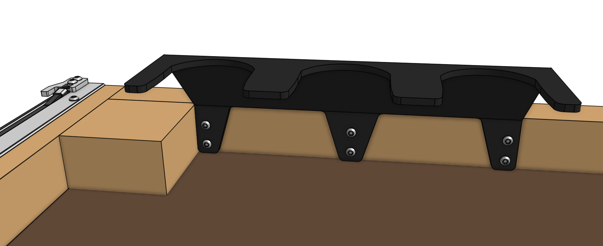
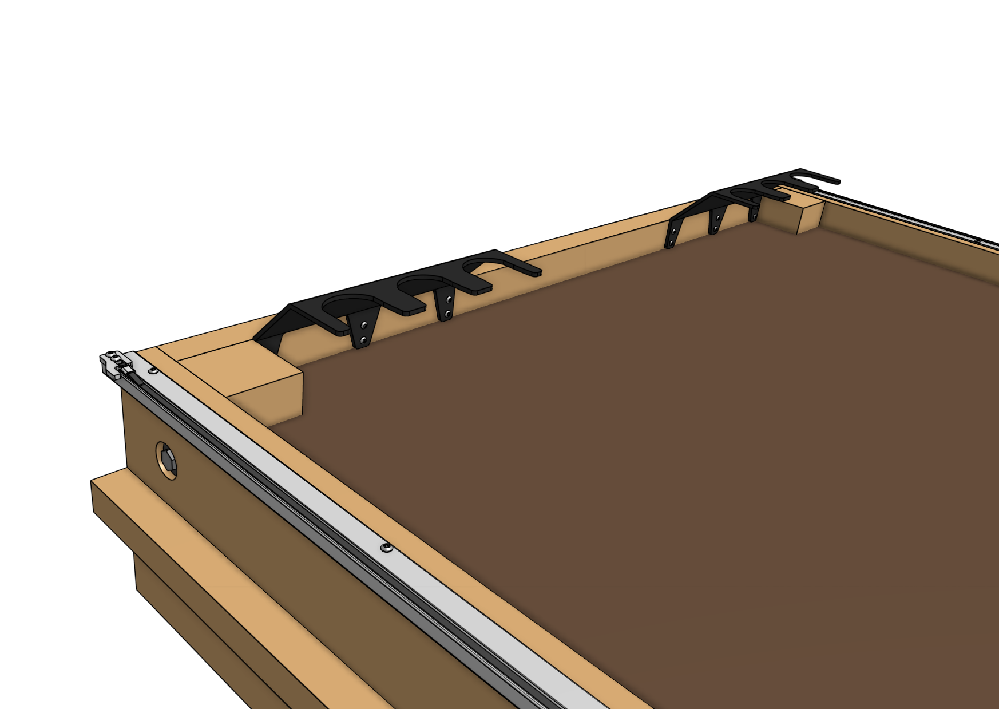
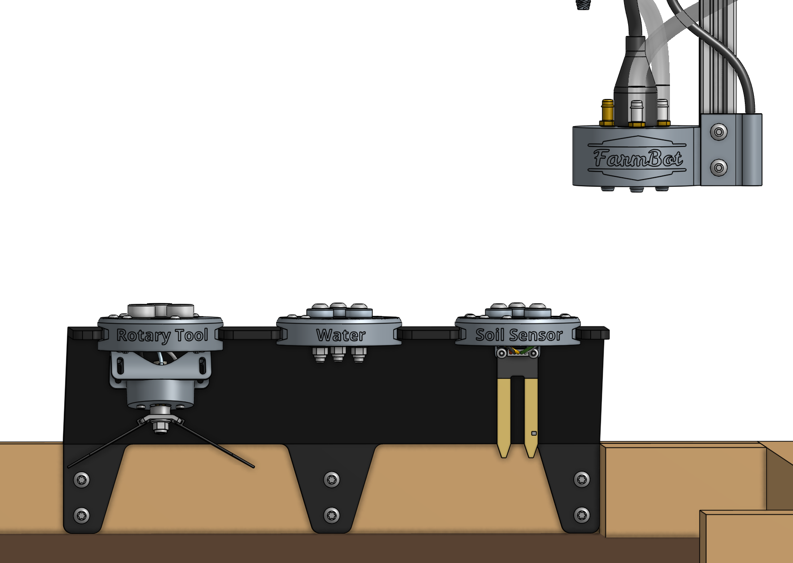

FarmBot Genesis comes with two [[3-slot toolbays]] that can hold a combination of three tools or seed containers each. These simple hardware components act as holsters for your tools and are shaped in such a way that FarmBot can automatically mount and dismount tools for the task at hand.

{% include gallery.html images='

<iframe width="100%" src="https://www.youtube.com/embed/vjvIB5wXmRo" frameborder="0" allow="accelerometer; autoplay; clipboard-write; encrypted-media; gyroscope; picture-in-picture" allowfullscreen title="FarmBot YouTube video"></iframe>
' %}



# Step 1: Attach to the supporting infrastructure

Position and attach a [[3-slot toolbay]] to one of the _shorter edges_ of your **supporting infrastructure** using six [[wood screws]]. The toolbay should be positioned such that FarmBot can:

* Mount and dismount tools from above
* Slide tools all the way into and out of the slots along the X-axis



# Step 2: Repeat for the second toolbay

# Step 3: Insert the tools

Place your tools and seed containers in any slot you want. The text on the front of the tools and seed containers should be facing the same direction as the FarmBot logo on the front of the UTM.



# What's next?

 * [Tools](tools.md)
