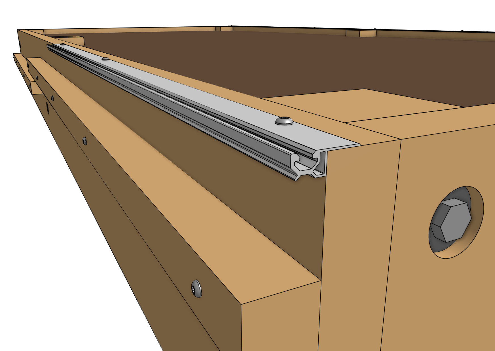
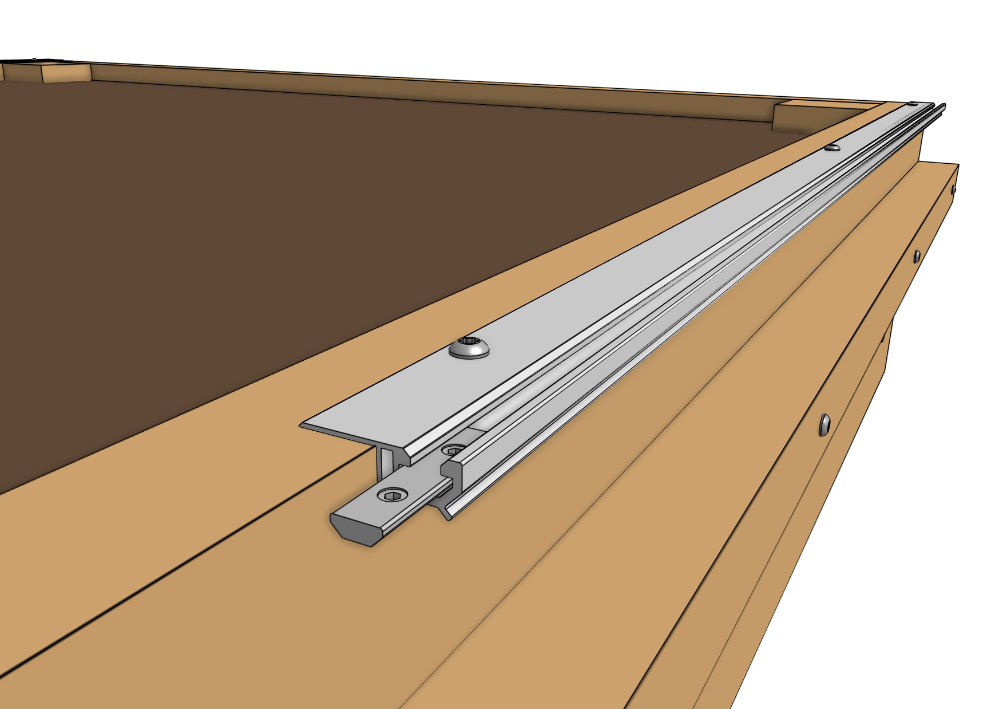
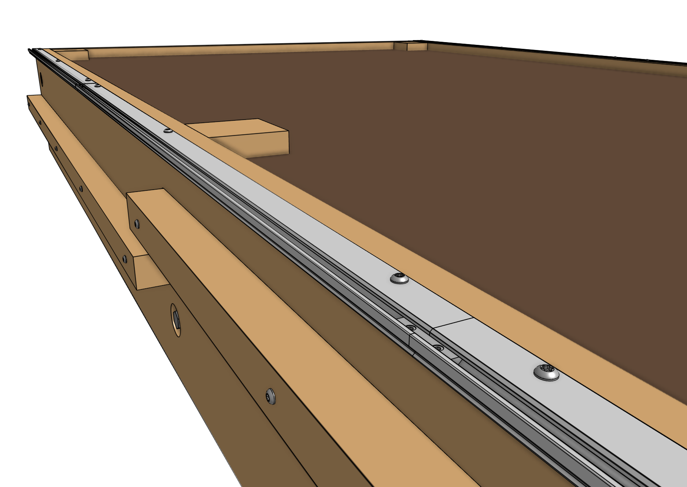
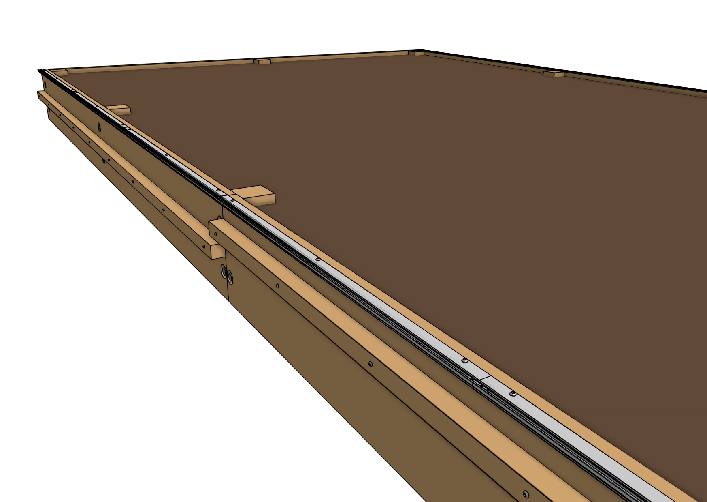

FarmBot's **tracks** allow the gantry to move precisely along the x-axis. They are designed to mount directly to the top of a raised bed or similar [supporting infrastructure](supporting-infrastructure.md). Each track is composed of 1m long aluminum extrusions positioned end-to-end to form a total track length of 3m for Genesis models and 6m for Genesis (XL).



The two tracks must be a parallel distance apart such that the gantry may span the distance between them and smoothly move from end to end. Tracks may be spaced closer together than the maximum, in which case you may consider cutting the gantry main beam so that it does not inconveniently extend beyond the tracks. Refer to the [maximum supporting infrastructure size table](../assembly/supporting-infrastructure.md#maximum-size) for details on maximum track spacing.

# Step 1: Lay out the track extrusions



Lay out all of the [[track extrusions]] in the location that you want to attach them to your **supporting infrastructure**. Make sure that extrusions are fully butted against each other.



# Step 2: Attach the first track extrusion

Attach the first [[track extrusion]] to the top of the supporting infrastructure using three [[T25 wood screws]] and the provided [[T25 bit]] loaded into a drill or driver. The track extrusion should be flush against the side and top of the supporting infrastructure.

# Step 3: Insert a nut bar

Insert a [[40mm nut bar]] halfway into the slot of the [[track extrusion]] and secure it with an [[M5 x 4mm setscrew]].

# Step 4: Attach the next extrusion

Position the next [[track extrusion]] on top of the supporting infrastructure and slide it towards the first extrusion such that the nut bar inserts into the slot.

With the second extrusion butted up against the end of the first extrusion, secure it to the supporting infrastructure with three [[T25 wood screws]]. Then secure the two extrusion ends together with a second [[M5 x 4mm setscrew]] in the nut bar.



# Step 5: Attach remaining extrusions

Repeat steps 3 and 4 to attach one more track extrusion for Genesis kits or four more for (XL) kits.



# Step 6: Install the other track

Repeat steps 2 through 5 for the track on the other side of the bed.

{%
include callout.html
type="warning"
title="Parallel or bust"
content='It is critical that the two tracks are **parallel** throughout the full length of the bed. Measure the distance between the two tracks at various locations along the tracks to ensure the distance is consistent. Use shims or other spacers to better align the tracks in case your supporting infrastructure is not perfect.

If the tracks deviate by more than about 1cm (0.5"), your FarmBot will have trouble moving throughout the full length of the tracks.'
%}

# Step 7: Sand away bumps

If needed, use **150 grit sand paper** to sand away any bumps on the **diagonal surfaces** of the extrusions that the FarmBot wheels ride upon. This will ease the movements of the FarmBot and improve longevity.



# What's next?

 * [Gantry](gantry.md)
