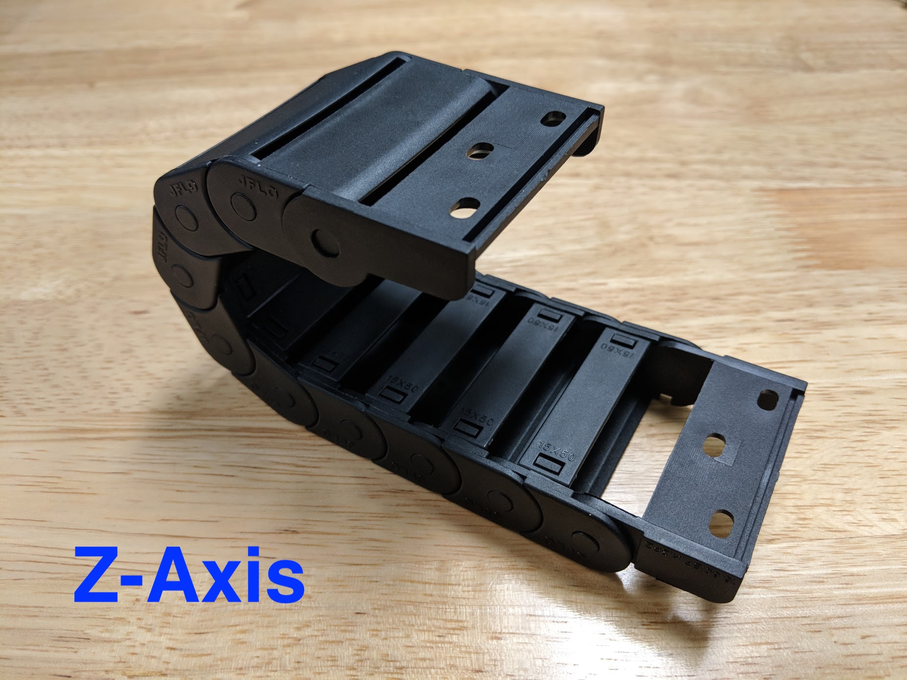

**Component tests**{:.internal}

|Test         |Description  |Target       |Tolerance    |
|-------------|-------------|-------------|-------------|
|Size         |Inspect the size marking embossed into the plastic.|See BOM spec|N/A
|Length       |Measure the length of the cable carrier using a measuring tape.|See BOM spec|0
|End pieces   |Inspect the orientation of the end pieces.|Oriented according to FarmBot system design|N/A
|Mount fit    |Connect the end pieces to the appropriate cable carrier mounts/supports using the appropriate hardware.|Should fit as expected|N/A
|Contents fit |Inert all cables and tubing into each cable carrier according to FarmBot system design.|Should fit as expected|N/A

# End piece configuration



