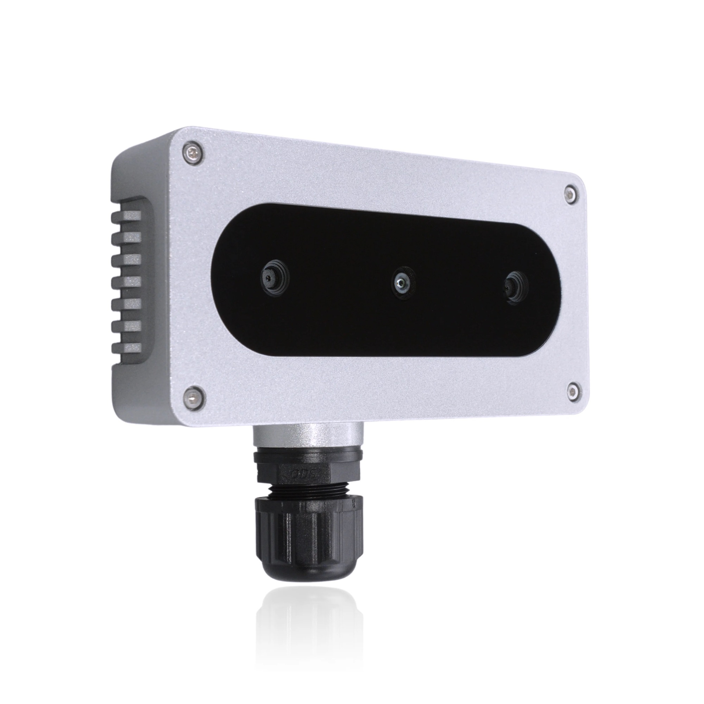

Take your FarmBot's imaging capabilities to the next level with an [OAK camera](https://shop.luxonis.com/collections/oak-cameras-1) from Luxonis. These cameras can be used to capture **3D point clouds** of your plants, run **AI classification models**, and more. They come in a variety of configurations including wide and standard fields of view, single and stereo sensors, USB and PoE connectivity, and with or without IP-rated water and dust proofing.

Which camera you choose will depend on your goals, operating environment (indoors or outdoors), and the mounting position of the camera. Example use cases include:

:camera_flash: **Photogrammetry** to create a digital twin of your FarmBot and plants

:seedling: Plant height and volume estimation to **track growth** over time

:sparkle: Plant **health monitoring using AI** classification models

:vulcan_salute:	Providing a **gesture control interface** for your FarmBot



# Connecting an OAK camera to FarmBot with sidecar hardware

At this time FarmBot OS does not natively support what makes an OAK camera an OAK camera. In other words, you cannot directly capture stereo images or utilize an OAK's AI capabilities via FarmBot OS and the web app.

Instead, you will need to connect the OAK camera to a [sidecar computer](https://developer.farm.bot/docs/sidecar-hardware), such as another Raspberry Pi, and then write your own software to control the OAK camera and communicate with FarmBot OS and the web app.

While this is a more advanced project that requires some programming knowledge, there are many resources available to help you get started:

- Refer to the [OAK documentation](https://docs.luxonis.com/) for setting up your sidecar, loading an AI model, and familiarizing yourself with the OAK API.
- Refer to the [FarmBot developer documentation](https://developer.farm.bot) for information on how to communicate with FarmBot OS and the web app from your [sidecar](https://developer.farm.bot/docs/sidecar-hardware).



# Using an OAK camera as a USB camera

You can use a **USB-based OAK camera** in place of the stock FarmBot [[camera]] if you are just looking for **higher resolution** images or a different **field of view**. Simply mount the OAK camera, plug it in, and perform [camera calibration](https://software.farm.bot/docs/camera-calibration).

This will allow you to capture higher resolution images using FarmBot's standard take photo commands. However, you will not be able to use the OAK camera's full capabilities such as stereoscopic capturing, depth mapping, or AI classification models with this method.



# What's next?

 * [Take Time Lapse Plant Photography](take-time-lapse-plant-photography.md)
 * [Use FarmBot as a 3D CNC Camera Rig](use-farmbot-as-a-3d-cnc-camera-rig.md)
