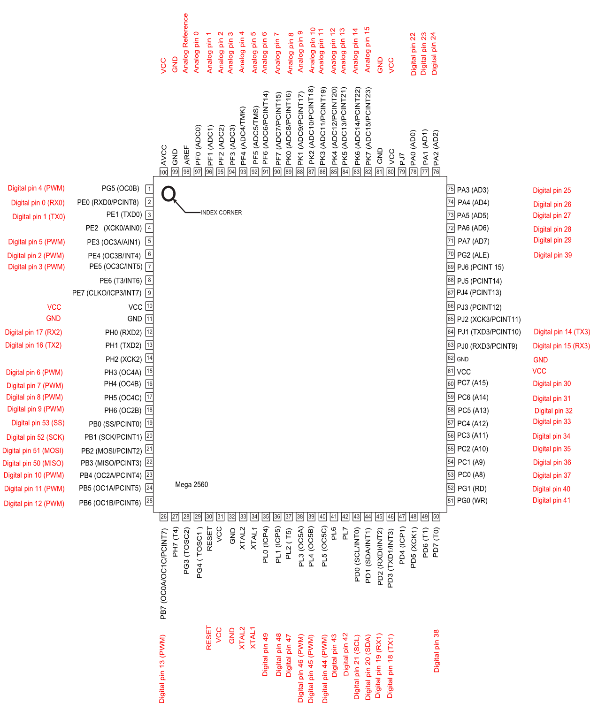

# Pinout reference table

|Mapped Pin Name  |v1.8 Farmduino                |
|-----------------|------------------------------|
|D0 (RX0)         |RXD0 (RX0)
|D1 (TX0)         |TXD0 (TX0)
|D2 (PWM)         |UTM E (Rotary Tool Forward)
|D3 (PWM)         |UTM H (Rotary Tool Reverse)
|D4 (PWM)         |Servo 0
|D5 (PWM)         |Servo 1
|D6 (PWM)         |Servo 2
|D7 (PWM)         |Lighting
|D8 (PWM)         |Water
|D9 (PWM)         |Vacuum
|D10 (PWM)        |Peripheral 4
|D11 (PWM)        |Servo 3
|D12 (PWM)        |Peripheral 5
|D13 (PWM)        |LED
|D14 (TX3)        |X2 EN
|D15 (RX3)        |X2 STEP
|D16 (TX2)        |Not exposed
|D17 (RX2)        |Not exposed
|D18 (TX1)        |D18 (available)
|D19 (RX1)        |D19 (available)
|D20 (SDA)        |I2C SDA
|D21 (SCL)        |I2C SCL
|D22              |STM32 NSS (Chip Select)
|D23              |Z CS
|D24              |X1 CS
|D25              |X1 EN
|D26              |X1 STEP
|D27              |X1 DIR
|D28              |Y CS
|D29              |X2 CS
|D30              |X2 DIR
|D31              |Y EN
|D32              |Y STEP
|D33              |Y DIR
|D34              |Z EN
|D35              |Z STEP
|D36              |Z DIR
|D37              |AUX EN
|D38              |D38 (available)
|D39              |Z Diagnostics
|D40              |AUX STEP
|D41              |AUX DIR
|D42              |D42 (available)
|D43              |AUX CS
|D44 (PWM)        |AUX Diagnostics
|D45 (PWM)        |Y Diagnostics
|D46 (PWM)        |X2 Diagnostics
|D47              |X1 Diagnostics
|D48              |Rotary Tool Fault Indication
|D49              |STM32 Read Enable (Reset)
|D50 (MISO)       |SPI MISO
|D51 (MOSI)       |SPI MOSI
|D52 (SCK)        |SPI SCK
|D53 (SS)         |SPI SS
|A0 (D54)         |Lighting Load Sense
|A1 (D55)         |Water Load Sense
|A2 (D56)         |Peripheral 5 Load Sense
|A3 (D57)         |Peripheral 4 Load Sense
|A4 (D58)         |Vacuum Load Sense
|A5 (D59)         |UTM D (Soil Sensor)
|A6 (D60)         |Rotary Tool Load Sense
|A7 (D61)         |A7 (available)
|A8 (D62)         |A8 (available)
|A9 (D63)         |UTM C (Tool Verification)
|A10 (D64)        |Z-MAX
|A11 (D65)        |Z-MIN
|A12 (D66)        |Y-MAX
|A13 (D67)        |Y-MIN
|A14 (D68)        |X-MAX
|A15 (D69)        |X-MIN

# 2560 chip pinout
## Diagram

_https://www.arduino.cc/en/Hacking/PinMapping2560_

## Table

|Chip Pin #  |Chip Pin Name            |Mapped Pin Name  |
|------------|-------------------------|-----------------|
|1           |PG5 ( OC0B )             |D4 (PWM)
|2           |PE0 ( RXD0/PCINT8 )      |D0 (RX0)
|3           |PE1 ( TXD0 )             |D1 (TX0)
|4           |PE2 ( XCK0/AIN0 )        |
|5           |PE3 ( OC3A/AIN1 )        |D5 (PWM)
|6           |PE4 ( OC3B/INT4 )        |D2 (PWM)
|7           |PE5 ( OC3C/INT5 )        |D3 (PWM)
|8           |PE6 ( T3/INT6 )          |
|9           |PE7 ( CLKO/ICP3/INT7 )   |
|10          |VCC                      |VCC
|11          |GND                      |GND
|12          |PH0 ( RXD2 )             |D17 (RX2)
|13          |PH1 ( TXD2 )             |D16 (TX2)
|14          |PH2 ( XCK2 )             |
|15          |PH3 ( OC4A )             |D6 (PWM)
|16          |PH4 ( OC4B )             |D7 (PWM)
|17          |PH5 ( OC4C )             |D8 (PWM)
|18          |PH6 ( OC2B )             |D9 (PWM)
|19          |PB0 ( SS/PCINT0 )        |D53 (SS)
|20          |PB1 ( SCK/PCINT1 )       |D52 (SCK)
|21          |PB2 ( MOSI/PCINT2 )      |D51 (MOSI)
|22          |PB3 ( MISO/PCINT3 )      |D50 (MISO)
|23          |PB4 ( OC2A/PCINT4 )      |D10 (PWM)
|24          |PB5 ( OC1A/PCINT5 )      |D11 (PWM)
|25          |PB6 ( OC1B/PCINT6 )      |D12 (PWM)
|26          |PB7 ( OC0A/OC1C/PCINT7 ) |D13 (PWM)
|27          |PH7 ( T4 )               |
|28          |PG3 ( TOSC2 )            |
|29          |PG4 ( TOSC1 )            |
|30          |RESET                    |RESET
|31          |VCC                      |VCC
|32          |GND                      |GND
|33          |XTAL2                    |XTAL2
|34          |XTAL1                    |XTAL1
|35          |PL0 ( ICP4 )             |D49
|36          |PL1 ( ICP5 )             |D48
|37          |PL2 ( T5 )               |D47
|38          |PL3 ( OC5A )             |D46 (PWM)
|39          |PL4 ( OC5B )             |D45 (PWM)
|40          |PL5 ( OC5C )             |D44 (PWM)
|41          |PL6                      |D43
|42          |PL7                      |D42
|43          |PD0 ( SCL/INT0 )         |D21 (SCL)
|44          |PD1 ( SDA/INT1 )         |D20 (SDA)
|45          |PD2 ( RXDI/INT2 )        |D19 (RX1)
|46          |PD3 ( TXD1/INT3 )        |D18 (TX1)
|47          |PD4 ( ICP1 )             |
|48          |PD5 ( XCK1 )             |
|49          |PD6 ( T1 )               |
|50          |PD7 ( T0 )               |D38
|51          |PG0 ( WR )               |D41
|52          |PG1 ( RD )               |D40
|53          |PC0 ( A8 )               |D37
|54          |PC1 ( A9 )               |D36
|55          |PC2 ( A10 )              |D35
|56          |PC3 ( A11 )              |D34
|57          |PC4 ( A12 )              |D33
|58          |PC5 ( A13 )              |D32
|59          |PC6 ( A14 )              |D31
|60          |PC7 ( A15 )              |D30
|61          |VCC                      |VCC
|62          |GND                      |GND
|63          |PJ0 ( RXD3/PCINT9 )      |D15 (RX3)
|64          |PJ1 ( TXD3/PCINT10 )     |D14 (TX3)
|65          |PJ2 ( XCK3/PCINT11 )     |
|66          |PJ3 ( PCINT12 )          |
|67          |PJ4 ( PCINT13 )          |
|68          |PJ5 ( PCINT14 )          |
|69          |PJ6 ( PCINT 15 )         |
|70          |PG2 ( ALE )              |D39
|71          |PA7 ( AD7 )              |D29
|72          |PA6 ( AD6 )              |D28
|73          |PA5 ( AD5 )              |D27
|74          |PA4 ( AD4 )              |D26
|75          |PA3 ( AD3 )              |D25
|76          |PA2 ( AD2 )              |D24
|77          |PA1 ( AD1 )              |D23
|78          |PA0 ( AD0 )              |D22
|79          |PJ7                      |
|80          |VCC                      |VCC
|81          |GND                      |GND
|82          |PK7 ( ADC15/PCINT23 )    |A15 (D69)
|83          |PK6 ( ADC14/PCINT22 )    |A14 (D68)
|84          |PK5 ( ADC13/PCINT21 )    |A13 (D67)
|85          |PK4 ( ADC12/PCINT20 )    |A12 (D66)
|86          |PK3 ( ADC11/PCINT19 )    |A11 (D65)
|87          |PK2 ( ADC10/PCINT18 )    |A10 (D64)
|88          |PK1 ( ADC9/PCINT17 )     |A9 (D63)
|89          |PK0 ( ADC8/PCINT16 )     |A8 (D62)
|90          |PF7 ( ADC7 )             |A7 (D61)
|91          |PF6 ( ADC6 )             |A6 (D60)
|92          |PF5 ( ADC5/TMS )         |A5 (D59)
|93          |PF4 ( ADC4/TMK )         |A4 (D58)
|94          |PF3 ( ADC3 )             |A3 (D57)
|95          |PF2 ( ADC2 )             |A2 (D56)
|96          |PF1 ( ADC1 )             |A1 (D55)
|97          |PF0 ( ADC0 )             |A0 (D54)
|98          |AREF                     |Analog Reference
|99          |GND                      |GND
|100         |AVCC                     |VCC

# Abbreviation guide

|Abbreviation  |Meaning                    |
|--------------|---------------------------|
|A             |Analog
|CS            |Chip Select
|D             |Digital
|DIR           |Direction
|EN            |Enable
|GND           |Ground
|MISO          |Main In Sub Out (SPI)
|MOSI          |Main Out Sub In (SPI)
|PWM           |Pulse Width Modulation
|RX            |Receive
|SCK           |Serial Clock (SPI)
|SCL           |Serial Clock Line (I2C)
|SDA           |Serial Data Line (I2C)
|SS/NSS        |Sub Select (SPI)
|TX            |Transmit
|VCC           |Voltage Common Collector

