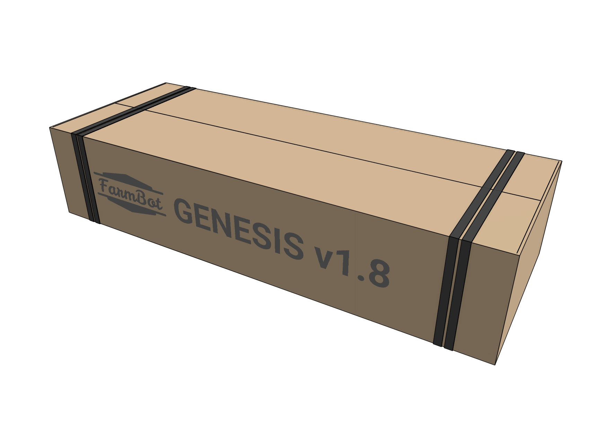

The tables below show the items that should be packed into the **main carton** for each version of the kit.

# Genesis packing list

|Item|Sub-packing|Qty|
|----|-----------|---|
|[[Track Extrusion]] - 1000mm|Wrapped with recycled kraft paper|6|
|[[Gantry Main Beam]] - 750mm|Wrapped with recycled kraft paper|2|
|[Hardware Kit](hardware-kit.md)|None|1
|X-Axis [[Cable Carrier]] (15 x 30 x 1600mm)|None (no plastic bag)|1
|Y-Axis [[Cable Carrier]] (15 x 30 x 1700mm)|None (no plastic bag)|1

# Genesis XL packing list

|Item|Sub-packing|Qty|
|----|-----------|---|
|[[Track Extrusion]] - 1000mm|Wrapped with recycled kraft paper|12|
|[[Gantry Main Beam]] - 1000mm|Wrapped with recycled kraft paper|3|
|(XL) [Hardware Kit](hardware-kit.md)|None|1
|X-Axis [[Cable Carrier]] (15 x 30 x 3100mm)|None (no plastic bag)|1
|Y-Axis [[Cable Carrier]] (15 x 30 x 3200mm)|None (no plastic bag)|1

# Straps

Add two pairs of black polystraps.

# Box specifications

|                                |                              |
|--------------------------------|------------------------------|
|**Box style**                   |Standard style box
|**Inner dimensions (L x W x H)**|1030 x 380 x 212.5mm
|**Outer dimensions (L x W x H)**|1040 x 390 x 222.5mm
|**Material**                    |Cardboard
|**Color**                       |Brown
|**Printing**                    |<a href="https://cad.onshape.com/documents/6626b842adca229e69544ad1/v/29ff27176ad028c3b865f257/e/7a90fddf83edcfb01fd55db6">Main Carton Box Graphics</a>
|**Fill**                        |Recycled kraft paper

